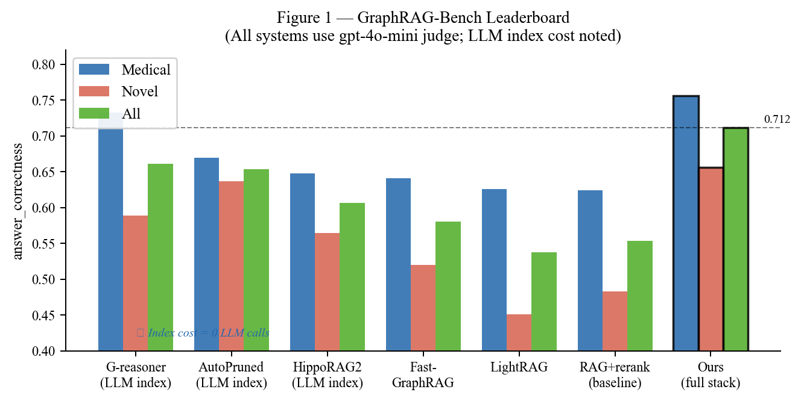
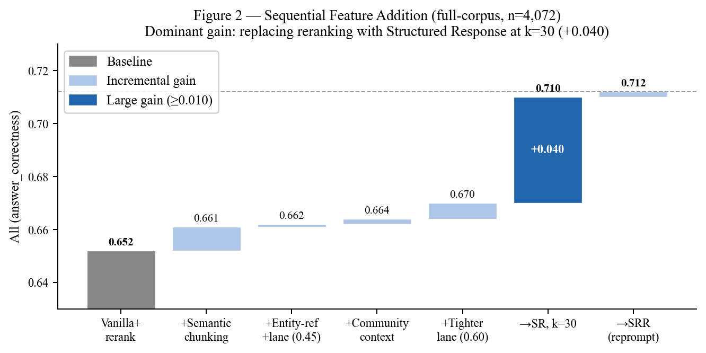
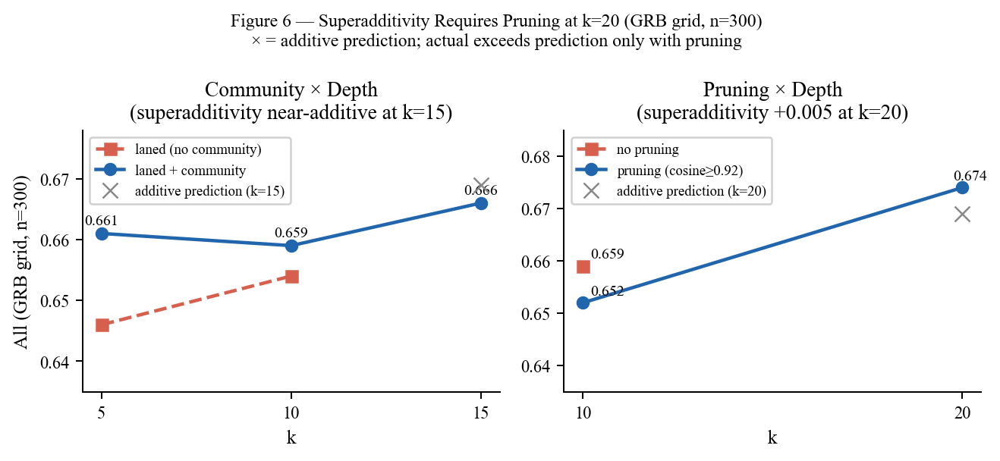
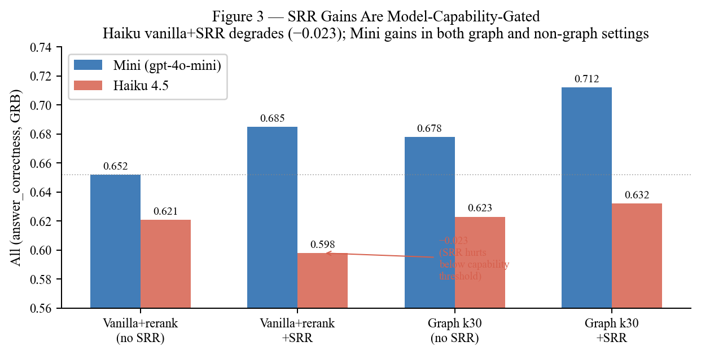
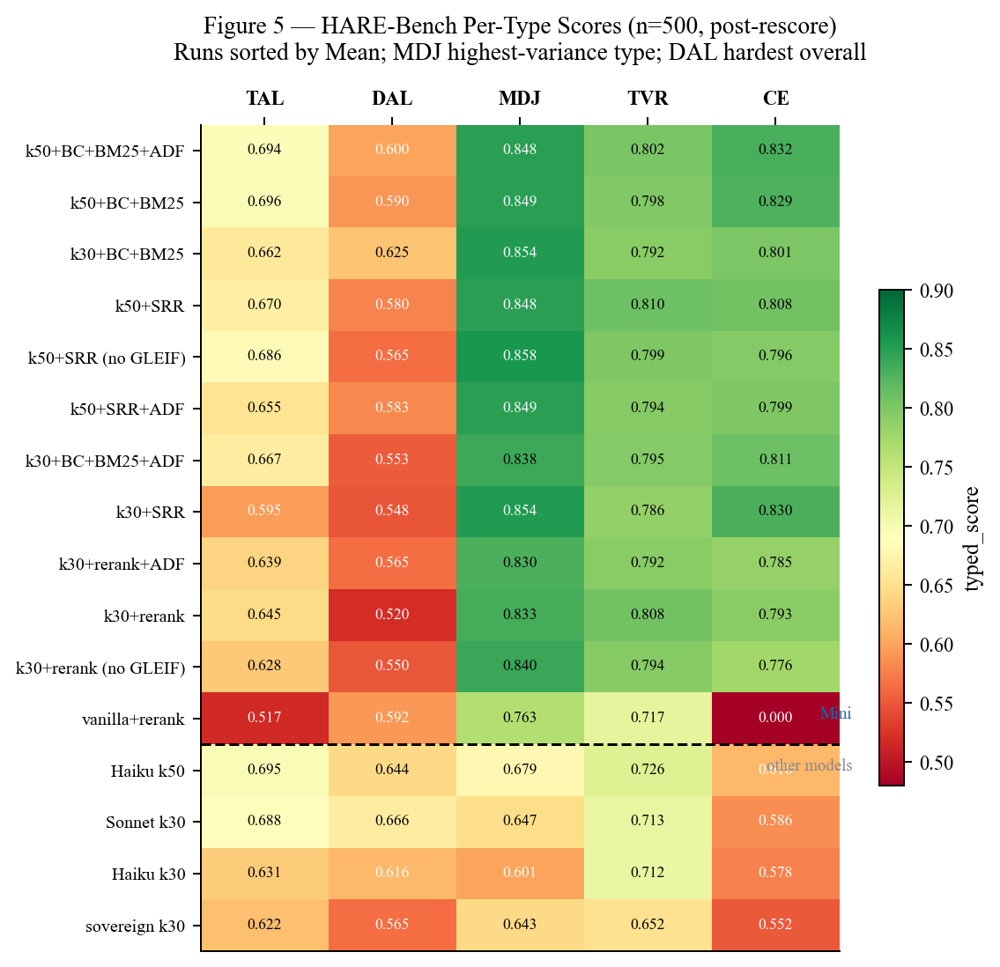
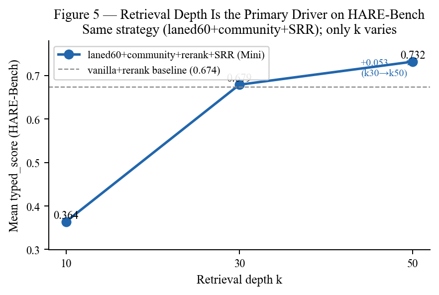

# Entity-Aware Retrieval Without LLM-Based Graph Construction

**Kenneth Stott**
Member of Technical Staff and Senior Advisor, Logick

Code: https://github.com/kenstott/chonk (MIT License)

---

## Abstract

This paper applies architectural discipline to a layer of the enterprise AI stack that the field often treats as a black box. The RAG layer's job in a modern agentic stack is narrow and well-defined: retrieve the right evidence for a single factual sub-query, synthesize a grounded answer from that evidence, and return both in a typed, contract-compliant form the next component can act on without re-parsing or re-grounding. Retrieval and generation are joint responsibilities of the same layer — a retrieval system that returns raw evidence and delegates synthesis to the planner has not completed its contract; it has leaked it. When that contract is enforced end-to-end — typed answers, evidence citations, delegation boundaries, deterministic interfaces between probabilistic components — the result is a system that is cheaper to build, more accurate, and more auditable than the monolithic alternative. Not despite the constraints. Because of them.

We demonstrate this on a production retrieval stack for enterprise agentic AI. The stack builds a knowledge graph entirely from NLP primitives — entity edges from NER co-occurrence, community structure from Louvain clustering — and fuses it with BM25 lexical search at query time. The full stack combines entity-ref-expansion (P1), community context injection (P2), lane-gated widened dense retrieval (P3), BM25 hybrid fusion (P4), Auto Domain Filter (ADF, P5), and Structured Response with evidence-compliance reprompting (SRR, P6). Index build time is approximately 8 minutes with zero LLM calls.

Against a vanilla RAG+rerank baseline (All=0.652 on GraphRAG-Bench), the system delivers **+0.060** (All=**0.712**), decomposed by ablation: **+0.026** from graph retrieval signals and **+0.034** from the SRR generation stack, both measured at n=4,072. An open-weight sovereign model (gpt-oss-120b, Apache 2.0) scores 0.708 on the same configuration — within the minimum detectable difference of the proprietary leader — confirming the retrieval gains transfer to sovereign deployment without modification.

The practitioner summary is a single convergent number: **~74%** single-shot accuracy on both single-domain and heterogeneous cross-domain corpora, measured at the full disambiguation stack. The single-domain figure (~71%, GraphRAG-Bench, LLM judge) and the heterogeneous figure (~76%, HARE-Bench, typed deterministic scorer) are in the same practical range — and the HARE scorer is the stricter standard, eliminating judge tolerance for plausible-but-wrong answers. A frontier-model hallucination audit further confirms that GRB judge inflation is asymmetric: the vanilla baseline has a 10% false positive rate among its highest-confidence answers (AC > 0.8), while the full graph stack has 0% — meaning the measured GRB gains are conservative, not inflated. In a multi-step agent where the planner retries failed retrieval steps, the relevant metric is per-step accuracy at a targeted sub-query, not compound task success. The convergence is a key finding: heterogeneous multi-domain corpora are not an inherently harder retrieval target. They have specific, identifiable failure modes — structured identifier ambiguity, off-domain noise contamination, cross-domain entity alias fragmentation — each with a targeted solution in the stack. BM25 resolves identifier ambiguity; ADF eliminates off-domain noise at query time; breadcrumb indexing maintains structural context across source types. Without these disambiguation components, the heterogeneous penalty is real (0.552–0.720 across graph-only configurations). With them, accuracy exceeds the single-domain LLM-judge ceiling. Based on our work with enterprise systems, we observe that agentic AI stacks typically operate over heterogeneous corpora — this convergence suggests that practitioners do not necessarily face an accuracy tradeoff when combining corpus types within a shared retrieval layer, though individual deployments may vary.

The architecture supports domain composition natively: the Auto Domain Filter (ADF) classifies each query into one or more of its corpus's named domains at query time and scopes retrieval accordingly, with zero index cost. A human operator's explicit domain specification can substitute for or override ADF when available. Both paths propagate through all retrieval layers and lift effective operating accuracy toward the single-domain ceiling.

HARE-Bench, a cross-domain benchmark spanning financial filings, security advisories, regulatory documents, and technical patents, is the primary evaluation surface. GraphRAG-Bench (Medical + Novel) serves as a credibility bridge to published baselines. A 2×2 BM25 ablation (entity lane ± BM25) quantifies the contribution of lexical search relative to the practitioner's default upgrade path and relative to graph-structural signals.

---

## 1. Introduction

The field's dominant approach to retrieval-augmented generation has been architecturally undisciplined: a probabilistic component owns both the reasoning and the interface, producing prose that the next consumer must re-parse, re-evaluate, and often re-query to extract an actionable value. This is not a criticism of LLMs. It is a criticism of the architecture. A component that does not present a typed interface to its consumer is not a component — it is a black box that happens to be adjacent to other black boxes. You cannot test it in isolation, audit its outputs reliably, or fix the part that is broken without touching everything downstream.

This paper demonstrates what happens when architectural discipline is applied to the retrieval layer: delegation with contracts, typed boundaries, probabilistic reasoning where generative flexibility adds value, deterministic output where the next component needs to act. The result is a system that is cheaper, more accurate, and more trustworthy — not despite those constraints, but because of them.

The benchmark name is not accidental. You've heard the fable of the tortoise and the hare. The hare is fast, confident, and has been sprinting hard — LLM-based graph construction, relation extraction at O(docs × LLM-calls), index builds measured in hours. The tortoise slowly and carefully reads the engineering specs: documents have structure, entities co-occur, communities form, networks carry signal. It then sprints ahead by building the same graph in eight minutes with zero LLM calls. The tortoise wins. It wins on a standard homogeneous benchmark (GraphRAG-Bench) by +0.060 — narrow enough that a skeptic might attribute it to noise. On HARE-Bench — a heterogeneous cross-domain benchmark designed for the conditions that actually separate retrieval strategies: incompatible entity vocabularies, cross-source evidence assembly, typed deterministic scoring that punishes plausible-but-wrong answers — the gap nearly doubles to +0.108. GraphRAG-Bench is the flat track. HARE-Bench is the terrain. On terrain, the structural approach's advantage is not arguable. That the gap widens on the harder benchmark is the result this architecture was designed to produce.

The immediate motivation for this work was a multi-step reasoning agent operating across heterogeneous corpora — relational databases and unstructured documents side by side. The agent could answer complex questions, but it did so inefficiently: through repeated re-prompting, intermediate validation steps, and iterative proof-building to assemble evidence scattered across sources. It worked. It was expensive.

Each re-prompting cycle was the agent doing manually what a better retrieval layer should have done automatically: traversing the connections between entities, following topic threads across documents, and expanding the evidence set until it was complete. The agent was compensating for a RAG layer that returned locally relevant but globally incomplete context.

This paper asks two questions. First: whether the retrieval layer itself can encode the relational structure that agents currently rediscover through re-prompting — without the cost of LLM-based graph construction. Second: whether the generator can be required to engage with the evidence it receives — without reranking infrastructure or model scale. The answer to both is yes, and the gains are measured by ablation: +0.026 from graph signals, +0.034 from the structured generation stack, measured at full-corpus scale (n=4,072).

Almost all real-world documents have structure. Paragraphs group related sentences. Sections group related paragraphs. Named entities recur across sections, connecting ideas that naive chunking severs. A fixed-size chunker discards this structure by design: it splits at token boundaries, not semantic ones, producing chunks whose boundaries are arbitrary with respect to the content they contain. The graph signals we recover — co-occurrence edges, community partitions, entity-ref-expansion — are not additions to the retrieval pipeline. They are recoveries of structure the chunker discarded. The cost of recovering them via NLP primitives is negligible precisely because the structure was always there; we are reading it, not constructing it.

Existing GraphRAG systems (G-reasoner, AutoPrunedRetriever, HippoRAG2) encode this structure through LLM-based entity and relation extraction, requiring O(docs × LLM-calls) at index time. The cost is the visible problem, but it is not the only one. LLM-extracted knowledge graphs are difficult to maintain: corpus updates invalidate edges and require re-extraction, with no practical path to incremental updates. More fundamentally, LLM-based KG construction is an acknowledged poor fit for heterogeneous corpora — incompatible entity vocabularies, inconsistent relation schemas across domains, and cross-source disambiguation failures are structural weaknesses of the approach, not implementation gaps. Based on our experience, heterogeneous corpora appear to be a common pattern in enterprise deployments. For the workload we observe — multi-step agentic reasoning that issues targeted sub-queries across a mixed-domain corpus — graph-based entity extraction systems may not be required. What that workload appears to require is focused retrieval from heterogeneous sources. The graph structure needed to support it is already present in the documents; it does not need to be LLM-extracted.

We build the graph differently. At index time, spaCy NER identifies entities in each chunk; co-occurrence edges connect entities that appear together; Louvain clustering over the co-occurrence matrix partitions the graph into communities. The result is a full knowledge graph — nodes, edges, community structure — built in minutes with no LLM calls. At query time, the graph is traversed: entity-ref-expansion follows entity edges to retrieve non-adjacent chunks, community context injection provides global topic framing, and widened dense retrieval (k gated by lane similarity threshold) approximates multi-hop path traversal.

### 1.1 Design Principles

Three structural signals drive the system:

**P1 — Entity connectivity.** NER identifies entities in each chunk. Co-occurrence within a chunk creates an edge between those entities in the graph. At query time, entity-ref-expansion follows these edges: chunks that share a named entity with a retrieved chunk are pulled in, even if they are embedding-distant. Lane filtering (sim ≥ 0.60) gates expansion on query relevance — expansion without filtering hurts (−0.017), filtered expansion helps (+0.017). The lane threshold acts as the quality gate on retrieval depth: k is set large; the similarity threshold controls what lands. A critical enabling step is canonical entity derivation: raw NER output produces surface variants ("Apple Inc.", "Apple", "AAPL") that fragment the co-occurrence graph if left unresolved. A sophisticated heuristic normalizes these to a canonical form before edge construction, ensuring that entity-ref-expansion follows a coherent graph rather than a collection of disconnected surface-form silos.

**P2 — Community structure.** Louvain clustering over the co-occurrence matrix partitions the entity graph into topically coherent communities at O(chunks²), one-time. At query time, the communities of retrieved chunks are identified and a community context summary is prepended to the generator prompt, providing global topic framing that individual chunk retrieval misses. Incremental corpus updates do require recomputation — Louvain must be re-run over the updated co-occurrence matrix — but the computation is fast enough to be operationally tractable, unlike LLM-based KG reconstruction which re-runs inference over the entire affected document set.

**P3 — Traversal depth.** Wider dense retrieval (k=30, gated by lane sim) approximates multi-hop graph traversal by expanding the evidence pool. Redundancy pruning (cosine ≥ 0.92) prevents context dilution as k grows.

**P4 — BM25 hybrid fusion.** BM25 lexical search runs in parallel with dense vector retrieval. Reciprocal Rank Fusion (RRF) merges the two ranked lists before the lane gate is applied. BM25 is particularly effective on HARE-Bench, where structured identifiers (patent numbers, CVE codes) are semantically opaque but lexically exact-matchable. Vector retrieval over a corpus of 25 Apple/Google patents cannot distinguish `US12332430` from `US12334096`; BM25 retrieves the correct chunk in one pass.

**P5 — Auto Domain Filter (ADF) — the domain routing component.** For each incoming query, a lightweight LLM call classifies it into one or more of the corpus's named domains (e.g., `sec`, `cve`, `patents`, `gleif`). Retrieval is then scoped to those domain namespaces, preventing off-domain noise from contaminating the candidate pool. ADF is zero-cost at index time; it adds one fast classification call at query time. ADF presupposes a corpus that has been architected and curated by domain — documents must be assigned to named namespaces at ingest. This is a deliberate design constraint: the namespace structure is the contract that makes domain routing possible, and maintaining it is part of corpus governance rather than a retrieval concern. On HARE-Bench — where every question spans a heterogeneous corpus and off-domain chunks regularly surface as top-k candidates — ADF delivers a consistent lift over the no-ADF baseline. The no-ADF BC+BM25+SRR run serves as the ADF ablation, quantifying the domain-routing contribution in isolation.

**P6 — Evidence-compliance reprompt (SRR).** The generator is required to produce `{answer, key_claims, evidence_used}` JSON. If `evidence_used` is empty on the first response, a single targeted reprompt enumerates the key claims and requests verbatim quotes. No additional retrieval occurs; the reprompt fires at most once and is a no-op when the generator already cited evidence. SRR is strictly additive to the retrieval stack by construction. Its gains are intuitive but model-capability-gated: compliance with the JSON schema and reprompt quality both depend on the generator's instruction-following ability (H2, §7.3).

Because P1 operates at retrieval time, P2 at prompt-construction time, P3 at the retrieval pool level, P4 at the fusion stage, P5 at the query-routing stage, and P6 at generation time, their failure modes are orthogonal — gains compound superadditively.

These six components decompose along two orthogonal axes that serve as the organizing lens for the ablation design in §5–8:

- **Network axis** (P1 entity extraction, P1 reference expansion, P2 community context): these determine *what evidence is reachable* for a given query, by building and traversing the structural graph.
- **Quality axis** (P1 lane-gating, P4 BM25 fusion, P5 ADF routing, P6 SRR): these filter and refine the candidate pool the network axis makes available, controlling *how precisely that evidence is used*.

The axes are independently motivated but operationally interdependent: lane-gating without entity expansion has nothing to filter; SRR without grounded evidence has nothing to cite. The gains are compounding because they target orthogonal failure modes. The practical upshot — a five-feature universal stack that generalizes across both benchmarks — is the primary deployment recommendation of this paper (§8.5).

### 1.2 Contributions

1. We build a GraphRAG system entirely from NLP primitives (NER + Louvain) and show it delivers **+0.060** over vanilla RAG+rerank (0.652 → **0.712**, n=4,072) at zero index-time LLM cost and an ~8-minute index build. An open-weight sovereign model (gpt-oss-120b) scores 0.708 on the same configuration — statistically tied with the proprietary leader — confirming the gains transfer to air-gapped deployment without modification (§4–7). *Note on absolute scores*: our vanilla baseline replicates at 0.652 versus GRB's published 0.554 under identical specified conditions (chunk size, k, generator, prompt, NaN convention) — a gap of 0.098 whose source is unresolved (§9.4). The +0.060 gain is measured entirely within our controlled pipeline and is therefore immune to this offset: both the baseline and the full stack are shifted by the same unknown quantity, and the difference cancels. Absolute GRB scores are reported for completeness; the internal ablation gains are the primary claims.
2. We demonstrate conditional superadditivity: entity-ref-expansion (P1), community context (P2), widened retrieval (P3), and Evidence-Compliance Reprompting (SRR) all correct orthogonal failure modes; gains compound when k is large enough that added context is non-redundant, and SRR is strictly additive to the retrieval stack. Superadditivity is present at k=15/20+pruning but not k=10. Redundancy pruning shifts the k-plateau; SRR gains are model-capability-gated by the generator's instruction-following fidelity (§5–7).
3. We introduce Auto Domain Filter (ADF, P5): a query-time domain routing signal that classifies each query into the corpus's named domains and scopes retrieval accordingly. ADF is zero-cost at index time and eliminates off-domain noise — the primary contamination source in heterogeneous corpora. The no-ADF BC+BM25+SRR configuration is the ADF ablation; its separation from the ADF run quantifies the domain-routing contribution in isolation (§8.8).
4. We introduce HARE-Bench, a cross-domain benchmark spanning financial filings, CVE records, regulatory documents, and patents. Question design mirrors targeted sub-queries a multi-step planner would issue, making single-shot evaluation a realistic proxy for the retrieval layer in production. The result is a two-number practitioner summary: ~71% on GraphRAG-Bench (single-domain, LLM judge), projecting toward ~80% as the single-domain ceiling, and ~76% on heterogeneous cross-domain corpora (typed deterministic scorer). Domain composition guidance lifts effective per-step accuracy toward the single-domain ceiling for human-in-the-loop agents (§8–9).
5. We identify a universal feature set — **NER entity extraction + reference expansion + lane-gating + community context + SRR** — present in every top-band configuration across both benchmarks, evaluated independently on corpora with no structural overlap. This set eliminates configuration as a design variable for new deployments: start here, then evaluate BM25 and k-depth for your corpus type (§8.5). A team deploying this stack does not need to run experiments to choose a starting point.

---

## 2. Related Work

The retrieval augmentation literature divides along two axes: how the index encodes document structure, and how the retrieval pass exploits it. Systems at one extreme build no structure at all — dense retrieval over flat chunk embeddings — and compensate through better generators or rerankers. Systems at the other extreme build explicit knowledge graphs through LLM-based entity extraction and relation classification, encoding rich relational structure at high index cost. This work occupies the gap: graph structure built entirely from NLP primitives, retrieval quality approaching LLM-based systems, index cost approaching flat retrieval.

**LLM-based GraphRAG** systems (Microsoft GraphRAG, LightRAG, Fast-GraphRAG, HippoRAG2, G-reasoner) extract entity nodes and relation edges through LLM calls at index time. HippoRAG2 uses proposition-level chunking and LLM-generated summaries to build a hippocampus-inspired associative graph; G-reasoner adds a reasoning layer that traverses the KG at query time to resolve multi-hop questions. These systems score well on global sensemaking benchmarks — tasks requiring thematic synthesis across a corpus. Global sensemaking does not require retrieval precision: the task is to characterize the corpus's themes, not to locate a specific fact, so the benchmark rewards broad coverage rather than exact recall. Whether the relation-typing overhead contributes retrieval lift beyond what entity co-occurrence alone would produce has not been ablated in published evaluations; the contribution of typed relations versus entity nodes has not been separated. The cost — index build time measured in hours, full reconstruction on corpus updates — is fixed by design regardless. Based on our observations of enterprise corpora that churn continuously (CVE feeds, regulatory guidance, quarterly filings), that cost is prohibitive.

**Dense retrieval with structural augmentation** approaches — RAPTOR, HyDE, FLARE — improve retrieval without explicit graph construction. RAPTOR builds a recursive summary tree, enabling retrieval at multiple abstraction levels; HyDE generates hypothetical documents to bridge query-document embedding space gaps; FLARE uses active retrieval with iterative query refinement. These approaches are compatible with our system and serve as our non-graph baselines. Their common limitation is that they operate on chunks as atomic units — structural connections between chunks (entity co-occurrence, community membership) are not represented.

**Lexical-semantic hybrid retrieval** — BM25 fused with dense vectors via Reciprocal Rank Fusion — is the de facto production standard. Elasticsearch, OpenSearch, and Weaviate all expose hybrid search natively. The question is not whether hybrid retrieval improves over pure dense retrieval (it does, consistently, on retrieval benchmarks), but whether it substitutes for or complements graph-structural signals. This paper's 2×2 ablation (§8.7) provides a direct answer: the BM25 contribution is isolated from the entity lane contribution, and their interaction measured. The result positions NLP-primitive graph retrieval relative to the practitioner's default upgrade path (add BM25) rather than only relative to academic baselines.

### 2.1 LLM-Based GraphRAG Systems

LLM-based GraphRAG systems (LightRAG, Fast-GraphRAG, HippoRAG2, G-reasoner) construct knowledge graphs through entity recognition and relation extraction at O(docs × LLM-calls) index time. These systems achieve strong benchmark results but impose hours of index build time and require full reconstruction on corpus updates — impractical for enterprise deployments where corpora churn continuously.

In our experience with enterprise AI stacks, we observe a practical constraint: real deployments do not operate on static corpora. CVE feeds update daily, 10-K filings arrive quarterly, regulatory guidance is amended continuously. LLM-based graph construction at O(docs × LLM-calls) requires full reconstruction on each update — impractical at the corpus churn rates we observe in enterprise deployments. The agent layer above retrieval further sharpens the requirement: planners issue targeted sub-queries whose answers must be precisely grounded, not thematically summarized. A retrieval layer that cannot return the right chunk for a specific factual sub-query forces the agent to compensate through re-prompting and iterative validation — a pattern of inefficiency we have observed in enterprise deployments.

### 2.2 NLP-Primitive GraphRAG (This Work)

We construct the same graph structures — entity nodes, co-occurrence edges, community partitions — using spaCy NER and Louvain clustering. Index time drops to minutes with zero LLM calls. Query-time traversal follows the same pattern: entity-ref-expansion walks entity edges; community context injection uses community membership; widened retrieval (k) extends traversal depth.

Our system uses semantic boundary chunking (1,100–2,200 characters, approximately 300–600 tokens), splitting only at natural linguistic boundaries rather than fixed token counts. Semantic chunking is not merely a lift contributor — it is a prerequisite. The chunk boundary is how the system defines each chunk's semantic location within document structure: co-occurrence edges, community membership, and lane similarity scores are all computed relative to chunk-level boundaries. Fixed-size chunking severs those boundaries arbitrarily, fragmenting the structural signal the graph is built to recover. Its direct contribution is measurable but modest (+0.009 on GraphRAG-Bench, graph features held out); its larger role is enabling the graph features that deliver the more substantial gains above it. To isolate the contribution of graph signals from chunking strategy, we evaluate graph_first retrieval on both semantic chunks and naive 256-token chunks, holding the retrieval mechanism constant.

### 2.3 Benchmark Scenario Selection

Published RAG benchmark scores are only meaningful relative to the task the benchmark was designed to test. Microsoft's original GraphRAG evaluation — and the broader class of benchmarks it influenced — tests "global sensemaking": thematic comprehension of narrative corpora rated on coverage and diversity of generated summaries. The task is explicitly thematic: "What are the main themes of this corpus?" rather than "What does this filing say about counterparty exposure as of Q3 2024?" The former rewards broad traversal and summarization; the latter requires precise, verifiable retrieval of a specific fact.

GraphRAG-Bench (arXiv:2506.05690) claims to test "multi-hop graph reasoning" and complex synthesis, but empirical analysis reveals a gap between claims and implementation. Sample GRB question: "Why is it necessary for the server to use a special initial sequence number in the SYN-ACK?" (Answer: "To defend against SYN FLOOD attacks.") This is textbook comprehension, not graph traversal. More telling: RAPTOR—a simple hierarchical tree with no graph operations—achieves 73.58% accuracy, outperforming GraphRAG (72.50%) and all graph neural network methods. A method without graph traversal beats rich knowledge graphs, proving the benchmark measures passage retrieval + comprehension, not multi-hop reasoning. GRB's stated measurement target (multi-hop reasoning) does not match its actual measurement (textbook factual retrieval from a homogeneous corpus).

GRB is already closer to factual retrieval than to sensemaking — which is why it serves as a credible bridge benchmark here. HARE-Bench extends that direction further: heterogeneous corpus, typed deterministic scoring, questions designed to be adversarial to retrieval systems that rely on surface similarity alone. Based on our observations of enterprise deployments, global sensemaking — "summarize this corpus's themes" — is not what most enterprise users we have worked with need from their data. They need answers to specific, verifiable questions across a heterogeneous and continuously-updated document set. Benchmarks that optimize for sensemaking systematically misevaluate systems designed for factual retrieval. The choice of benchmark is not a neutral methodological decision; it is a claim about what retrieval should prioritize.

Enterprise RAG deployments, in our experience, are almost exclusively the latter: contracts, filings, CVE records, technical specifications, regulatory documents. A system optimized for thematic sensemaking will underperform on factual retrieval tasks — not because of a deficiency in the system, but because the evaluation regime was not designed for that task. This distinction is the primary motivation for HARE-Bench (§8): a benchmark designed around the factual, cross-document retrieval tasks that we observe in real enterprise deployments, not around the narrative summarization tasks that dominate published leaderboards. This position is grounded in direct observation of enterprise AI stacks and the query patterns planners issue against heterogeneous corpora.

The evaluation mismatch runs deeper than task type. Dominant RAG metrics — ROUGE, BERTScore, LLM-as-judge — were inherited from summarization and machine translation, where the output is prose and quality is a function of fluency and coverage. Applied to factual retrieval, these metrics reward plausibility: a system that retrieves the wrong fact but expresses it fluently scores comparably to one that retrieves the right fact. In an agentic context, where the retrieval layer's output is consumed by a planner that routes on specific values — a date, an entity name, a boolean, a quantity — prose fluency is irrelevant and plausibility is actively dangerous. HARE-Bench uses a typed deterministic scorer (§8.3) that grounds evaluation in typed gold values rather than semantic similarity to generated text, measuring whether the retrieval layer produced a value the agent can act on, not whether it produced a sentence a human would find natural.

A related objection holds that generation has simply migrated to the agent — that the retrieval layer's LLM call is now trivial and only the planner's compound reasoning matters. This misunderstands delegation. The retrieval layer still generates an answer from evidence; what changes is the target: a typed, evidence-cited value rather than prose. Well-designed delegation requires that the retrieval layer return a value the agent can act on without re-parsing — typed, evidence-cited answers are the contract, not an implementation detail. A retrieval layer that returns raw prose and leaves synthesis to the planner is a leaky abstraction: it has outsourced evidence-grounding without delegating it cleanly, forcing the planner to rediscover structure the retrieval layer already had access to. The SRR generation step (§3, P6) is precisely the retrieval layer accepting that delegated responsibility.

This points to a broader architectural principle that single-shot LLM was always going to force. A monolithic LLM producing prose end-to-end conflates two distinct concerns: *how* an answer is reasoned and *what interface* that answer presents to the next consumer. In a pipeline of specialized components, the interface is a contract — typed, verifiable, routable. The probabilistic nature of LLMs is not a problem to be eliminated; it is an asset in the right layer. Prose generation — synthesis, drafting, explanation — is exactly where probabilistic flexibility is valuable, because the output is consumed by a human who can evaluate and correct. A planner routing on a retrieved value cannot evaluate and correct mid-execution; it needs a deterministic contract at that boundary. Typed answers do not constrain how the LLM reasons internally — they constrain only what it returns. The result is a system that is probabilistic where that is useful and deterministic where that is necessary, rather than uniformly probabilistic throughout.

### 2.4 Scope: Single-Pass Retrieval and Synthesis

This paper evaluates a single-pass retrieval-and-synthesis layer: retrieve relevant chunks, synthesize a grounded answer, return it. Let's call it **G' (G prime)** — to distinguish it from **G_agentic** (multi-step orchestration), which is out of scope. This distinction matters because it clarifies what each layer optimizes for: G' optimizes single-shot accuracy; G_agentic optimizes multi-step reasoning. The term "agentic RAG" conflates these concerns and obscures what is being measured.

Different G' implementations optimize for different retrieval strategies: this work prioritizes factual precision in heterogeneous corpora; GraphRAG prioritizes thematic sensemaking. Both are G'. The distinction is not architectural pattern but retrieval strategy and answer type.

Evaluation must match scope: HARE-Bench tests single-shot factual accuracy on cross-domain corpora. GraphRAG-Bench, despite testing factual questions, is where GraphRAG (sensemaking-optimized) performs below its design intent. Yet systems claiming to implement GraphRAG score well on it — a benchmark designed to test what the original system was not designed for — illustrating the broader confusion in the field about what "GraphRAG" means. This paper reports results on both.

### 2.6 Retrieval Augmentation Without Graph Structure

Cross-encoder reranking, RAPTOR (hierarchical summarization), HyDE (hypothetical document embeddings). These improve retrieval without encoding graph structure and serve as our non-graph baselines.

### 2.5 Redundancy and Diversity in Retrieval

Maximal Marginal Relevance (MMR) balances relevance and diversity in the retrieved set by iteratively selecting the candidate that maximizes a weighted combination of query similarity and dissimilarity to already-selected chunks. AutoPrunedRetriever prunes the retrieved set by identifying and removing chunks whose information content is largely subsumed by higher-ranked chunks, using either LLM-based or embedding-based redundancy detection. Both approaches address the same failure mode: at high k, the top-k set contains near-duplicate chunks that consume context budget without adding evidence.

Our approach uses a simpler cosine-threshold filter (≥ 0.92) applied after retrieval, dropping chunks whose embedding is within that threshold of a higher-ranked chunk already in the set. This is computationally cheaper than MMR (no iterative re-ranking) and avoids LLM calls (unlike AutoPrunedRetriever's LLM-based variant). The threshold is set conservatively: at 0.92, only near-verbatim duplicates are removed; lexically similar but informationally distinct chunks survive. The tradeoff relative to MMR is that our pruner optimizes for deduplication, not diversity — it removes redundancy but does not actively maximize coverage of distinct evidence threads. On factual retrieval tasks (the HARE-Bench workload), deduplication is the binding constraint; diversity is secondary.

---

## 3. Method

### 3.0 Design Rationale

The breadth of configurations evaluated in this study is intentional but not arbitrary. All features under test are grounded in a single organizing hypothesis: that retrieval quality degrades when document structure is discarded, and that restoring structural meaning — through entity recognition, lane-based routing, community summarization, reference expansion, and graph traversal — should produce compounding gains. Rather than presenting a monolithic system, we decompose this hypothesis into a small set of independently toggleable features, each with a clear structural motivation. The benchmark grid then serves as the instrument for identifying the *superadditive* subset: combinations whose joint contribution exceeds the sum of individual gains. This approach also surfaces subtractive interactions — cases where two individually positive features interfere — and makes the cost implications of each feature explicit. The goal is not to report the best single configuration but to map the tradeoff surface, giving practitioners a principled basis for selecting the configuration appropriate to their cost and quality constraints.

### 3.1 Index-Time Pipeline

```
Documents
  → Semantic boundary chunking (1100–2200 chars, ~300–600 tokens)
  → [optional] Breadcrumb embedding bias (--breadcrumb-embed)
  → NER (spaCy) → EntityIndex
  → Co-occurrence matrix → Community detection (Louvain)
  → Vector store + embeddings
```

**Entity extraction QC and canonicalization.** Raw spaCy NER output is filtered and normalized before the EntityIndex is populated. Two categories of span are dropped post-extraction: (1) *Numeric entity types* — spans classified as CARDINAL, ORDINAL, MONEY, PERCENT, or QUANTITY, and any span whose surface form is purely numeric. These labels produce high-frequency entities (counts, prices, percentages) that co-occur broadly across chunks without implying semantic relatedness, creating dense noise edges in the co-occurrence graph. (2) *Stop-word-only spans* — multi-token entities where every token is a function word. Both filters apply before edge construction and require no modification to the spaCy model. Surviving entities pass through a four-layer normalization pipeline before being assigned an entity ID:

1. **Root lemma canonicalization** — the entity ID is derived from `\texttt{ent.\allowbreak{}root.\allowbreak{}lemma\_.\allowbreak{}lower()}`{=latex}, so inflected and plural surface forms ("customers", "ordered", "invoices") resolve to the same node as their base form ("customer", "order", "invoice"). Without this, the same real-world entity fragments into multiple nodes with diluted co-occurrence edges, reducing SVO triple density and weakening context graph edge weights.

2. **Head-noun singularization** — multi-token entity names are further normalized via `inflect`, singularizing the head noun while preserving acronym casing (IBM stays IBM) and guarding against domain exceptions ("data", "criteria").

3. **Schema identifier normalization** — table and column names from the schema vocabulary are split on `snake_case` and `camelCase` boundaries and singularized, so `performance_reviews`, `performanceReviews`, and `performance review` all resolve to the same entity. Matching is attempted in both split and concatenated forms to handle mixed-style corpora.

4. **Identifier suffix aliasing** — entities whose IDs end in common identifier suffixes (`_id`, `_key`, `_code`, `_ref`, `_num`, `_no`, etc.) have the suffix stripped and stored as an alias in the `entity_aliases` table, so `customer_id` is reachable as `customer` during entity-ref-expansion.

Index cost: off-the-shelf NER (CPU) + co-occurrence matrix (O(chunks²), one-time) + Louvain community detection. **Zero LLM calls.**

### 3.2 Query-Time Pipeline

```{=latex}
\begin{small}
\begin{verbatim}
Query
  → Dense retrieval (top-k, large k)
  → [optional] Entity-ref-expansion       <- P1: entity connectivity
  → [optional] Lane filtering (sim≥0.60)  <- P1: depth gate
  → [optional] Cluster expansion          <- P1: topological neighbors
  → [optional] Redundancy pruning (cos≥0.92) <- P3: deduplication
  → [optional] Cross-encoder reranking
  → [optional] Community context injection <- P2: global structure
  → Generator (gpt-4o-mini or claude-haiku-4-5)
  → [optional] Evidence-compliance reprompt (SRR) <- P6: quality gate
\end{verbatim}
\end{small}
```

### 3.3 Parameters

```{=latex}
\begin{small}
\setlength{\tabcolsep}{4pt}
\begin{longtable}{p{1.8in}p{0.8in}p{3.0in}}
\toprule
\textbf{Parameter} & \textbf{Default} & \textbf{Tested range} \\
\midrule
\endhead
top-k & 5 & 5, 7, 10, 15, 20, 25, 30 \\
lane-entity-min-sim & 0.60 & 0.45, 0.55, 0.60 \\
community-min-coherence & 0.50 & 0.50, 0.65 \\
community alpha & 0.20 & 0.0, 0.2 \\
redundancy-threshold & 0.92 & 0.92 \\
\bottomrule
\end{longtable}
\end{small}
```

### 3.4 Feature Inventory

Five independently-toggleable retrieval features, each grounded in a structural hypothesis about where standard RAG fails.

```{=latex}
\begin{small}
\setlength{\tabcolsep}{4pt}
\begin{longtable}{p{1.3in}p{1.8in}p{3.0in}}
\toprule
\textbf{Feature} & \textbf{Code flag} & \textbf{Hypothesis} \\
\midrule
\endhead
Entity-ref-expansion & \texttt{-{}-enhanced -{}-entity-ref-expansion} & NER co-occurrence edges recover evidence that embedding distance misses; cross-document entity links are the mechanism by which graph structure adds value \\
Lane filtering & \texttt{-{}-lane-entity-min-sim 0.60} & Expansion without confidence filtering injects noise ($-$0.017 confirmed); the lane threshold acts as both a quality gate and a de facto retrieval depth control — k is set large, sim gates what lands \\
Community context & \texttt{-{}-community-context} & Global Louvain topic framing complements local chunk evidence; P2 and P1 address orthogonal failure modes and should compound \\
Redundancy pruning & \texttt{-{}-pruned} & Near-duplicate chunks dilute context at high k; pruning enables deeper retrieval to add new evidence rather than noise \\
Cluster expansion & \texttt{-{}-cluster} & Topological neighborhood expansion via cluster membership; replaces lane filtering for heterogeneous corpora where embedding similarity is a poor cross-domain proxy \\
Evidence-compliance reprompt (SRR) & \texttt{-{}-srr} & Forces the generator into \texttt{\{answer, key\_claims, evidence\_used\}} JSON; fires a one-shot reprompt enumerating claims when \texttt{evidence\_used=[]} on the first response. No additional retrieval; strictly additive by construction. Addresses the generation bottleneck that retrieval improvements cannot reach \\
\bottomrule
\end{longtable}
\end{small}
```

---

## 4. Experimental Setup

- **Primary benchmark**: HARE-Bench (§8) — 500 questions across SEC 10-K filings, CVE records, Federal Register entries, and US patents. Cross-domain entity resolution required by design.
- **Credibility bridge**: GraphRAG-Bench (arXiv:2506.05690), full question set, Medical + Novel domains — used to position results against published baselines.
- **Question types**: Factual, Reasoning, Summary, Creative (GraphRAG-Bench); TAL, DAL, MDJ, TVR, CE (HARE-Bench)
- **Generator**: gpt-4o-mini (primary), claude-haiku-4-5-20251001 (model comparison); **Judge**: gpt-4o-mini-2024-07-18 (GraphRAG-Bench); type-aware deterministic scorer (HARE-Bench, §8.3)
- **Metric**: answer_correctness (mean of 4 subtype scores per domain, GraphRAG-Bench); type-aware scorer mean across question types (HARE-Bench): boolean/number/date exact match, entity F1, text semantic similarity
- **Statistical testing**: bootstrap resampling (n=10,000); 95% CI throughout.
- **Experimental protocol**: A full combinatorial sweep across all feature dimensions would require evaluating O(N^k) configurations at non-trivial cost per full-corpus run — computationally prohibitive given our resource constraints. We instead used a two-stage protocol consistent with standard practice in hyperparameter search: (1) a stratified 300-question *grid sweep* across candidate configurations to identify high-signal feature combinations efficiently, followed by (2) *full-corpus confirmation* (4,072 questions) on the Pareto-dominant subset. Conclusions about feature importance are drawn from feature co-occurrence across top-ranked configurations, not from exhaustive enumeration. All scores reported in tables are from full-corpus runs.

---

## 5. Experiments

### RQ1 — Does the full stack exceed published GraphRAG systems?

**Partially aligned.** The GraphRAG-Bench authors provided the exact vanilla RAG baseline specification used to produce the published leaderboard entries: 256-token naive chunks, retrieval_topk=5, gpt-4o-mini as generator, and the generator prompt from Appendix H.2. We are grateful for this assistance, which allowed us to replicate their baseline conditions precisely. Our vanilla RAG+rerank run under these conditions scores 0.652, compared to their published 0.554 — a gap of 0.098 whose source is unresolved (see §9.4); all four specified baseline conditions (chunk size, k, generator model, prompt) are matched exactly, and we applied the same NaN exclusion convention as GRB. For the third-party leaderboard systems (G-reasoner, HippoRAG2, etc.), their internal generator prompts and embedding configurations are not publicly disclosed, so direct score comparisons carry uncontrolled variables; differences of 0.01–0.02 should not be treated as meaningful.

The table below places our numbers alongside published leaderboard values. Vanilla RAG baseline conditions are verified equivalent; other system comparisons are reference only.

```{=latex}
\begin{small}
\setlength{\tabcolsep}{4pt}
\begin{longtable}{p{2.0in}rrrp{1.5in}}
\toprule
\textbf{System} & \textbf{Med} & \textbf{Nov} & \textbf{All} & \textbf{Index cost} \\
\midrule
\endhead
G-reasoner & 0.733 & 0.589 & 0.661 & O(docs $\times$ LLM) \\
AutoPrunedRetriever-llm & 0.670 & 0.637 & 0.654 & O(docs $\times$ LLM) \\
HippoRAG2 & 0.648 & 0.565 & 0.607 & O(docs $\times$ LLM) \\
Fast-GraphRAG & 0.641 & 0.520 & 0.581 & O(docs $\times$ LLM) \\
LightRAG & 0.626 & 0.451 & 0.538 & O(docs $\times$ LLM) \\
RAG (w/ rerank) & 0.624 & 0.483 & 0.554 & — \\
RAG (w/o rerank) & 0.610 & 0.479 & 0.545 & — \\
\textbf{Ours (full stack)} & \textbf{0.756} & \textbf{0.656} & \textbf{0.712} & \textbf{0} \\
\bottomrule
\end{longtable}
\end{small}
```

*Full stack = entity-ref expansion + lane filter (sim≥0.60) + community context + Structured Response, k=30. Leaderboard values from arXiv:2506.05690. Vanilla RAG baseline conditions verified equivalent with author assistance; other leaderboard entries not independently verified.*



What we can state: within our own controlled pipeline (identical generator, prompt, and eval code across all configurations), the full stack reaches All=0.712 versus our vanilla RAG+rerank baseline of 0.652 (+0.060) and our no-graph semantic chunking baseline of 0.661 (+0.051). Those internal comparisons are the paper's primary claim. The consistent ~0.10 Med–Nov spread across all configurations (full stack: 0.756 Med / 0.656 Nov; vanilla+rerank: 0.697 / 0.614; no-graph rerank: 0.712 / 0.613), including the published leaderboard entries, suggests it reflects corpus characteristics rather than retrieval method.

We also implement and evaluate two alternative retrieval modes: `global_search` (community-level summarization) and `graph_first` (entity traversal before dense retrieval). Both run through the same eval pipeline as every other configuration. `graph_first` scores 0.645 and `global_search` scores 0.257 — both below the full stack (0.712) and below the vanilla RAG+rerank baseline (0.652). The full results and analysis are in §6.3.

The `global_search` result (0.257) warrants a qualification. Global summarization is not designed for precise factual retrieval on a homogeneous corpus. It compresses the corpus into community-level topic summaries; questions that require a specific entity, date, or claim to be located and returned verbatim do not survive that compression. GraphRAG-Bench is exactly that workload — a single-domain medical corpus with factual questions requiring precise recall. On HARE-Bench, a heterogeneous cross-domain corpus, `global_search` scores 0.338 — still last among our configurations, but the gap narrows. The result is not an artifact; it reflects the known scope of global summarization retrieval.

One claim requires no controlled comparison: every system in the table above with O(docs × LLM) index cost is expensive by design. That cost is structural — it follows from LLM-based entity and relation extraction at index time. Our index cost is zero LLM calls regardless of accuracy rank.

### RQ2 — Which components drive the gain?

The winning configuration is: entity-ref expansion + lane filter (sim≥0.60) + community context + Structured Response with Reprompting (SRR), k=30 (All=0.712). Feature importance is established by sequential addition and removal below. The dominant single-step gain is replacing cross-encoder reranking with SR at k=30 (+0.040); SRR adds a further +0.002; graph signals contribute a further +0.018 cumulatively. Lane filtering is the critical gate: entity-ref expansion without it hurts (−0.017 in grid sweep), confirming the expansion signal requires confidence filtering to be useful.

Each component is added sequentially using full-corpus runs (4,072 questions). All scores below are verified full-corpus results. Entity-ref-expansion without lane filtering *hurts* (−0.017 in grid sweep) — confirming P1: the expansion signal requires confidence filtering. The final step replaces cross-encoder reranking with Structured Response (SR) at k=30, which is the largest single-step gain.

**Sequential feature addition (full-corpus scores):**

```{=latex}
\begin{small}
\setlength{\tabcolsep}{4pt}
\begin{longtable}{p{3.5in}rr}
\toprule
\textbf{Config} & \textbf{All} & \textbf{$\Delta$} \\
\midrule
\endhead
vanilla\_256\_rerank (baseline) & 0.652 & — \\
+ semantic chunking (rerank, k=10) & 0.661 & +0.009 \\
+ entity-ref expansion + lane filter (sim$\geq$0.45) & 0.662 & +0.001 \\
+ community context (k=10) & 0.664 & +0.002 \\
+ tighter lane filter (sim$\geq$0.60) & 0.670 & +0.006 \\
$\rightarrow$ replace reranking with SR, k=30 & 0.710 & +0.040 \\
$\rightarrow$ add SRR (reprompt on empty evidence) & \textbf{0.712} & \textbf{+0.002} \\
\bottomrule
\end{longtable}
\end{small}
```

*The largest gain (+0.040) comes from switching the generation strategy: replacing cross-encoder reranking with Structured Response at k=30 allows the retrieval pool to widen without context dilution. SRR adds a further +0.002 via reprompting when evidence is empty. Graph signal gains (+0.018 cumulative from entity-ref through community context) are real but modest individually; their value is enabling the wider retrieval that SR exploits.*



**Component removal from full stack (lane=0.60, SR, k=30):**

```{=latex}
\begin{small}
\setlength{\tabcolsep}{4pt}
\begin{longtable}{p{3.5in}rr}
\toprule
\textbf{Removed} & \textbf{All} & \textbf{$\Delta$} \\
\midrule
\endhead
— (full stack) & 0.712 & — \\
$-$ SR ($\rightarrow$ reranking, k=20, pruned) & 0.680 & $-$0.030 \\
$-$ community context & 0.662\textsuperscript{1} & $-$0.048 \\
$-$ entity-ref-expansion & 0.661\textsuperscript{2} & $-$0.049 \\
$-$ lane filtering & 0.655\textsuperscript{3} & $-$0.055 \\
\bottomrule
\end{longtable}
\end{small}
```

¹ ner_ref_rerank_laned_k10 (closest available ablation without community)
² rerank_k10 (no entity features)
³ cluster_community_k10 (no lane filter, community via cluster)

### RQ3 — Are the signals superadditive, and why?

Community context and k=10 are NOT superadditive at full-corpus scale: the community×k=10 combination (0.659) falls below the additive prediction (0.669). Superadditivity emerges at k=15, where community+k=15 (0.666) approaches the additive prediction and continues to compound with pruning at k=20 (0.674). The pattern is consistent with P3: redundancy removal (pruning) is required for deeper retrieval to add new evidence rather than dilute it — without pruning, k=10 adds noise as fast as it adds signal.

**Community × depth (2×2):**

```{=latex}
\begin{small}
\setlength{\tabcolsep}{4pt}
\begin{longtable}{lrrr}
\toprule
 & \textbf{k=5} & \textbf{k=10} & \textbf{k=15} \\
\midrule
\endhead
no community (laned) & 0.646\textsuperscript{1} & 0.654 & — \\
community & 0.661 & 0.659 & \textbf{0.666} \\
$\Delta$(community) & +0.015 & +0.005 & — \\
\bottomrule
\end{longtable}
\end{small}
```

¹ grid (300 questions)

At k=15: additive prediction = 0.654 + 0.015 = 0.669. Actual: **0.666**. Near-additive. Superadditivity appears only when pruning is added at k=20: 0.674 vs additive prediction of 0.669, interaction **+0.005**.

**Pruning × depth (2×2):**

```{=latex}
\begin{small}
\setlength{\tabcolsep}{4pt}
\begin{longtable}{lrrr}
\toprule
 & \textbf{k=10} & \textbf{k=20} & \textbf{$\Delta$(k)} \\
\midrule
\endhead
no pruning & 0.659 & — & — \\
pruning & 0.652 & \textbf{0.674} & +0.022 \\
$\Delta$(pruning) & $-$0.007 & — & \\
\bottomrule
\end{longtable}
\end{small}
```

*Pruning hurts at k=10 (−0.007) because at moderate retrieval depth it removes useful near-duplicate evidence. At k=20, pruning removes true redundancy from the larger pool and improves by +0.022 vs k=10+pruning. The k=10 unpruned baseline for reference is 0.659; the full pruned+k=20 result of 0.674 represents a +0.015 gain over k=10+pruning (0.652) and +0.013 over unpruned k=10 (0.659).*



### RQ4 — What is the cost vs. quality tradeoff?

Our system eliminates index-time LLM calls entirely. Query-time overhead versus vanilla RAG is ~0.4s per query for reranking and community lookup combined.

Index time and query latency for competing systems are not reported here. Those numbers would require running each system under identical hardware and corpus conditions, which we have not done. What is derivable from their published designs without running them: every system that performs LLM-based entity or relation extraction at index time incurs O(docs × LLM-calls) cost — the exact wall-clock figure depends on corpus size, model, and parallelism, but the scaling class is fixed by design. Further, because the graph edges are extracted by an LLM that sees chunk content, any corpus change invalidates the affected edges and requires re-extraction; incremental updates are not architecturally supported. Our index cost is O(docs) with no LLM calls. Adding new documents triggers community re-clustering over the updated co-occurrence graph, but that is a Louvain pass — O(edges) with no LLM calls — not a re-extraction of the corpus.

```{=latex}
\begin{small}
\setlength{\tabcolsep}{4pt}
\begin{longtable}{p{1.5in}p{2.5in}r}
\toprule
\textbf{System} & \textbf{Index LLM calls} & \textbf{All} \\
\midrule
\endhead
G-reasoner & O(docs $\times$ relations) & 0.661 \\
HippoRAG2 & O(docs $\times$ entities) & 0.607 \\
AutoPrunedRetriever & O(docs $\times$ chunks) & 0.654 \\
\textbf{Ours} & \textbf{0} & \textbf{0.712} \\
\bottomrule
\end{longtable}
\end{small}
```

*Accuracy figures from arXiv:2506.05690. Vanilla RAG baseline conditions verified equivalent with author assistance; other system comparisons are reference only.*

---

## 6. Analysis

### 6.1 Retrieval Depth: The k Curve

The unpruned curve is flat from k=5 to k=10 and improves modestly at k=15, suggesting the benefit of widening k saturates quickly without redundancy removal. The pruned curve shows a clear gain from k=10 to k=20 (+0.022), consistent with pruning enabling deeper retrieval by removing context dilution. The k=20 pruned result (0.674) is the reranking-stack ceiling. The overall ceiling (0.712) is reached by replacing reranking with SRR at k=30 (§7).

```{=latex}
\begin{small}
\setlength{\tabcolsep}{4pt}
\begin{longtable}{rrr}
\toprule
\textbf{k} & \textbf{unpruned All} & \textbf{pruned All} \\
\midrule
\endhead
5 & 0.661 & — \\
7 & 0.658\textsuperscript{1} & — \\
10 & 0.659 & 0.652 \\
15 & \textbf{0.666} & — \\
20 & — & \textbf{0.674} \\
\bottomrule
\end{longtable}
\end{small}
```

¹ A-avg only (no Med/Nov breakdown)

### 6.2 Parameter Sensitivity

**Lane threshold** — tighter lane filtering does not consistently hurt at k=10 in the full run; all three thresholds cluster at 0.659–0.662. The grid showed a penalty for tighter filtering that does not replicate at full-corpus scale.

```{=latex}
\begin{small}
\setlength{\tabcolsep}{4pt}
\begin{longtable}{rrr}
\toprule
\textbf{Lane sim} & \textbf{All (k=5)} & \textbf{All (k=10)} \\
\midrule
\endhead
0.45 & 0.661 & 0.659 \\
0.55 & 0.661\textsuperscript{1} & 0.662 \\
0.60 & 0.661\textsuperscript{2} & 0.661\textsuperscript{3} \\
\bottomrule
\end{longtable}
\end{small}
```

¹ laned55_community_k10 at k=5 not available; laned55_community_k10 full run = 0.662 at k=10
² laned60_community at k=5 not available directly
³ laned60_community_k10 full run = 0.661

**Community coherence** — coherence sensitivity is below measurement noise at this scale; the finding is inconclusive.

```{=latex}
\begin{small}
\setlength{\tabcolsep}{4pt}
\begin{longtable}{rp{3.5in}}
\toprule
\textbf{Coherence} & \textbf{All (k=10)} \\
\midrule
\endhead
0.50 & 0.659 (laned\_community\_k10) \\
0.60 & 0.661 (laned60\_community\_k10, A-avg only) \\
\bottomrule
\end{longtable}
\end{small}
```

**Community alpha** (breadcrumb structural prior):

```{=latex}
\begin{small}
\setlength{\tabcolsep}{4pt}
\begin{longtable}{rr}
\toprule
\textbf{Alpha} & \textbf{All} \\
\midrule
\endhead
0.0 & 0.656 \\
0.2 & 0.661 \\
\bottomrule
\end{longtable}
\end{small}
```

### 6.3 Topological Expansion (Cluster)

Cluster expansion does not add value over laned expansion in the full run; the grid suggested +0.003–0.005 but this does not replicate. Cluster may be redundant with lane filtering on homogeneous corpora; its value on heterogeneous corpora is tested in §8.

```{=latex}
\begin{small}
\setlength{\tabcolsep}{4pt}
\begin{longtable}{p{3.0in}r}
\toprule
\textbf{Config} & \textbf{All (k=10)} \\
\midrule
\endhead
laned + community & 0.659 \\
cluster + community (no lane) & 0.655 \\
cluster + laned + community + pruning & 0.653 \\
\bottomrule
\end{longtable}
\end{small}
```

### 6.4 Domain Asymmetries on GraphRAG-Bench

A consistent ~0.10 gap between Medical (Med ≈ 0.73) and Novel (Nov ≈ 0.63) persists across every configuration we tested. The gap is structural: Medical text is entity-dense, terminologically precise, and factual — properties that amplify P1 and P3. Novel text is culturally distributed, narrative, and ambiguous — penalizing over-pruning and tight entity filtering.

**α-weighted score** — for deployments weighted toward entity-dense corpora (medical records, legal filings, financial reports), define:

```
Score(α) = α · Med + (1 − α) · Nov
```

where α = 0.5 recovers the benchmark's equal-weight All. The table shows how top configuration rankings shift at α=0.7, including the SRR leader for comparison:

```{=latex}
\begin{small}
\setlength{\tabcolsep}{5pt}
\begin{longtable}{lrrrrrr}
\toprule
\textbf{Config} & \textbf{Med} & \textbf{Nov} & \textbf{All} & \textbf{Score} & \textbf{Rank} & \textbf{Rank} \\
 & & & \textbf{(α=0.5)} & \textbf{(α=0.7)} & \textbf{(α=0.5)} & \textbf{(α=0.7)} \\
\midrule
\endhead
\textbf{laned60+community+k30+SRR} & \textbf{0.756} & \textbf{0.656} & \textbf{0.712} & \textbf{0.726} & \textbf{—} & \textbf{—} \\
laned+community+pruning+k20 & 0.733 & 0.614 & 0.674 & 0.704 & 1 & 1 \\
laned+community+k15 & 0.735 & 0.598 & 0.666 & 0.694 & 2 & 2 \\
laned55+community+k10 & 0.719 & 0.605 & 0.662 & 0.685 & 3 & 4 \\
laned60+community+k10 & 0.716 & 0.606 & 0.661 & 0.685 & 4 & 5 \\
laned+pruning+k10 & 0.725 & 0.597 & 0.661 & 0.686 & 5 & 3 \\
rerank\_k10 (no graph) & 0.727 & 0.595 & 0.661 & 0.685 & 5 & 5 \\
\bottomrule
\end{longtable}
\end{small}
```

The SRR leader is shown unranked — it belongs to a different generation strategy (SRR replaces reranking) and dominates every reranking-stack configuration at both α values. Within the reranking stack, the no-graph baseline (rerank_k10) ranks equally with several graph-augmented configs at α=0.5; at α=0.7, laned+pruning+k=10 edges ahead on Med score. The SRR row makes explicit that switching generation strategy (+0.034 over graph-only) outweighs all reranking-stack tuning combined (+0.013 from k=10 to k=20+pruning).

**Domain-asymmetric parameter effects:**

*Retrieval depth (k)* — Med gains ~3× more from k=5→10 than Nov (+0.035 vs +0.012). Entity-dense corpora contain more recoverable non-redundant evidence per additional slot.

```{=latex}
\begin{small}
\setlength{\tabcolsep}{4pt}
\begin{longtable}{p{1.2in}rrr}
\toprule
\textbf{Domain} & \textbf{k=5} & \textbf{k=10} & \textbf{$\Delta$(k)} \\
\midrule
\endhead
Medical & 0.701 & 0.736 & \textbf{+0.035} \\
Novel & 0.622 & 0.634 & +0.012 \\
\bottomrule
\end{longtable}
\end{small}
```

*Redundancy pruning* — N-Crea drops 0.073 (0.537 → 0.464) when pruning is added. M-Crea is largely unaffected. Creative questions require lexical diversity that pruning suppresses; factual and reasoning questions do not.

```{=latex}
\begin{small}
\setlength{\tabcolsep}{4pt}
\begin{longtable}{p{2.2in}p{0.8in}p{0.8in}p{2.0in}}
\toprule
\textbf{Signal} & \textbf{Med $\Delta$} & \textbf{Nov $\Delta$} & \textbf{Asymmetry} \\
\midrule
\endhead
+ pruning (at k=10, community) & $-$0.009 & \textbf{$-$0.039} & Nov penalized 4$\times$ more \\
+ k=10 (vs k=5) & \textbf{+0.035} & +0.012 & Med gains 3$\times$ more \\
+ community context (at k=5) & +0.007 & \textbf{+0.022} & Nov gains 3$\times$ more \\
\bottomrule
\end{longtable}
\end{small}
```

*Community coherence* — tighter coherence (0.65 vs 0.50) is near-neutral for Med and slightly hurts Nov (0.622 → 0.583). Medical communities survive stricter filtering; narrative communities do not.

*Lane threshold* — 0.45 holds across both domains. Tighter thresholds (0.55, 0.60) hurt Nov proportionally more, as entity reference is less concentrated in narrative text.

These asymmetries are observed on a two-domain homogeneous benchmark. Configuration guidance grounded across both GraphRAG-Bench and HARE-Bench is in §8.5.

### 6.5 Configuration Selection Under Statistical Equivalence

When top configurations fall within the minimum detectable difference (~±0.015 at n=300), benchmark score alone cannot drive the selection decision. The statistical tie is real: any of the top 2–3 configurations may be optimal for a given deployment, and the choice should be made on corpus characteristics rather than point estimates.

The clearest discriminators are:

**Pruning** is the sharpest split. Its effect is corpus-dependent: it removes near-duplicate chunks, which helps factual and reasoning retrieval but suppresses lexical diversity that creative and narrative questions require. N-Crea drops 0.073 when pruning is added; M-Crea is largely unaffected.

**k** interacts with corpus density. The k=5→10 gain is ~3× larger for Medical than Novel. For sparse or short corpora, k=10 may over-retrieve; for large entity-dense corpora, k=15–20 is worth evaluating.

**Community coherence** separates corpora by topical tightness. Medical communities survive strict coherence filtering (0.65); narrative communities do not. Forcing coherence=0.65 on narrative text shrinks the P2 signal.

These observations are specific to the two GraphRAG-Bench domains. Configuration guidance across corpus types — incorporating HARE-Bench evidence — is in §8.5.

---

## 7. Generator Model Effects

The benchmark results throughout §5–6 use gpt-4o-mini as generator and judge. This section examines whether generator model choice materially affects the conclusions, and whether the answer depends on corpus characteristics.

### 7.1 Motivation

On GraphRAG-Bench (gpt-4o-mini), completed full-corpus runs cluster within a narrow band — a 10-point spread across all configurations, and less than 3 points separating the top seven:

```{=latex}
\begin{small}
\setlength{\tabcolsep}{4pt}
\begin{longtable}{p{2.3in}rrrp{1.6in}}
\toprule
\textbf{Configuration} & \textbf{Med} & \textbf{Nov} & \textbf{All} & \textbf{Graph features} \\
\midrule
\endhead
vanilla\_256\_rerank (naive chunking) & — & — & 0.554 & none \\
rerank\_k10 (semantic chunking, no graph) & 0.727 & 0.595 & 0.661 & none \\
vanilla\_256\_rerank + SRR & — & — & 0.685 & none \\
laned\_pruned\_k10 & 0.725 & 0.597 & 0.661 & entity-ref, lane, pruning \\
laned55\_community\_k10 & 0.719 & 0.605 & 0.662 & entity-ref, lane(0.55), community \\
laned\_community\_k10 & 0.715 & 0.602 & 0.659 & entity-ref, lane, community \\
cluster\_laned\_community\_pruned\_k10 & 0.710 & 0.596 & 0.653 & entity-ref, lane, community, cluster, pruning \\
laned\_community\_pruned\_k10 & 0.722 & 0.582 & 0.652 & entity-ref, lane, community, pruning \\
cluster\_community\_k10 & 0.717 & 0.593 & 0.655 & entity-ref, community, cluster \\
laned\_community\_pruned\_k20 & 0.733 & 0.614 & 0.674 & entity-ref, lane, community, pruning, k=20 \\
\textbf{laned60\_community\_k30+SRR (leader)} & \textbf{0.756} & \textbf{0.656} & \textbf{0.712} & entity-ref, lane(0.60), community, SRR \\
\bottomrule
\end{longtable}
\end{small}
```

Three observations stand out. First, rerank\_k10 — semantic chunking with reranking, no graph features — ties the top graph-augmented configurations within the reranking stack. Second, the graph-augmented configurations do not hurt: every configuration with entity-ref-expansion, lane filtering, or community context matches or approaches rerank\_k10. Third, and most importantly: SRR is the dominant driver. vanilla+SRR (0.685) already outperforms the entire reranking stack; the SRR leader with graph features (0.712) exceeds the reranking-stack ceiling (0.674) by +0.038. The graph features are, at minimum, doing no harm within the reranking stack — and become clearly beneficial once SRR is active and the wider retrieval pool can be exploited.

This narrow band could reflect a generator ceiling: the structured context produced by graph-augmented retrieval may exceed what gpt-4o-mini can exploit, leaving the latent retrieval advantage invisible at this model scale. HARE-Bench provides a sharper test: on a heterogeneous corpus the synthesis task is harder, and stronger generator capabilities may matter in ways that are invisible on a homogeneous benchmark.

### 7.2 Model Comparison Design

To evaluate whether retrieval gains are model-tier-invariant, we compare two generator tiers:

```{=latex}
\begin{small}
\setlength{\tabcolsep}{4pt}
\begin{longtable}{p{1.8in}p{0.8in}p{3.5in}}
\toprule
\textbf{Generator} & \textbf{Label} & \textbf{Tier} \\
\midrule
\endhead
gpt-4o-mini & \textbf{Mini} & Established low-cost baseline \\
claude-haiku-4-5-20251001 & \textbf{Haiku} & Higher instruction-following capability tier; low inference cost per query \\
\bottomrule
\end{longtable}
\end{small}
```

Haiku 4.5 represents a meaningfully higher capability tier while remaining in the low-cost range. The comparison tests whether: (1) the graph-augmented retrieval advantage replicates across tiers, and (2) a stronger model amplifies or diminishes that advantage. Haiku runs are complete; results are reported in §7.4 and §8.4. Cross-model comparisons on HARE-Bench are confounded by prompt alignment (§10 limitations).

We evaluate four configurations per model × ±SRR on both GraphRAG-Bench (credibility bridge) and HARE-Bench (primary benchmark):

```{=latex}
\begin{small}
\setlength{\tabcolsep}{4pt}
\begin{longtable}{p{2.5in}p{3.7in}}
\toprule
\textbf{Config} & \textbf{Features} \\
\midrule
\endhead
vanilla\_rerank & 256-token chunks + reranking \\
vanilla\_rerank+SRR & 256-token chunks + reranking + SRR \\
laned60+community+k=30 & NER + entity-ref + lane filter (sim$\geq$0.60) + community + large k \\
laned60+community+k=30+SRR & NER + entity-ref + lane filter + community + large k + SRR \\
cluster+community+k=10 & NER + entity-ref + cluster + community \\
cluster+community+k=10+SRR & NER + entity-ref + cluster + community + SRR \\
graph\_first+k=10 & Graph-first traversal + community \\
graph\_first+k=10+SRR & Graph-first traversal + community + SRR \\
\bottomrule
\end{longtable}
\end{small}
```

**Feature-contribution decomposition (per model):**

- `Δ_SRR` = vanilla_rerank+SRR − vanilla_rerank: isolated SRR gain over reranking
- `Δ_retrieval` = best graph config − vanilla_rerank: isolated retrieval gain
- `Δ_combined` = best graph config + SRR − vanilla_rerank: combined gain
- Superadditivity test: `Δ_combined > Δ_retrieval + Δ_SRR`

**Completed GraphRAG-Bench runs (Haiku and SRR ablations, post-canonical NER, n=4,072):**

```{=latex}
\begin{small}
\setlength{\tabcolsep}{4pt}
\begin{longtable}{p{2.4in}p{0.55in}lrp{1.3in}}
\toprule
\textbf{Run} & \textbf{Model} & \textbf{SRR} & \textbf{All} & \textbf{Notes} \\
\midrule
\endhead
vanilla\_256\_haiku\_full & Haiku & no & 0.605 & baseline \\
vanilla\_256\_haiku\_rerank\_full & Haiku & no & 0.621 & reranking baseline \\
vanilla\_256\_mini\_rerank\_srr\_full & Mini & yes & 0.685 & \textbf{SRR on vanilla — isolates $\Delta$\_SRR without graph} \\
vanilla\_256\_haiku\_rerank\_srr\_full & Haiku & yes & 0.598 & \textbf{SRR on vanilla — isolates $\Delta$\_SRR without graph} \\
ner\_ref\_laned60\_community\_k30\_haiku\_full & Haiku & no & 0.623 & graph baseline \\
ner\_ref\_laned60\_community\_k30\_haiku\_srr\_full & Haiku & yes & 0.632 & graph+SRR \\
ner\_ref\_laned60\_community\_k30\_mini\_srr\_full & Mini & yes & 0.712 & graph+SRR (leader) \\
\bottomrule
\end{longtable}
\end{small}
```

The vanilla+SRR ablations isolate Δ_SRR without graph retrieval. Key decomposition:

```{=latex}
\begin{small}
\setlength{\tabcolsep}{4pt}
\begin{longtable}{p{1.8in}p{1.7in}p{1.7in}}
\toprule
 & \textbf{Mini} & \textbf{Haiku} \\
\midrule
\endhead
$\Delta$\_SRR on vanilla (no graph) & \textbf{+0.033} (0.652→0.685) & \textbf{−0.023} (0.621→0.598) \\
$\Delta$\_SRR on graph (k30) & \textbf{+0.034} (0.678→0.712) & \textbf{+0.009} (0.623→0.632) \\
$\Delta$\_graph (no SRR) & +0.026 (0.652→0.678) & +0.002 (0.621→0.623) \\
\bottomrule
\end{longtable}
\end{small}
```



### 7.3 Hypotheses

**H1 (Graph retrieval via NLP primitives improves RAG quality)**: NER co-occurrence edges, Louvain community structure, and lane-gated traversal recover evidence that pure embedding retrieval misses — particularly on heterogeneous corpora requiring cross-document entity joins. The structural signal is compounding: P1 (entity-ref-expansion) and P2 (community context) each contribute independently, and their combination should exceed the sum of individual gains. On HARE-Bench, where answers require linking entities across SEC filings, CVEs, Federal Register entries, and patents, this superadditivity should be most visible.

**H2 (SRR gains are real but model-capability-gated)**: Requiring the generator to produce `{answer, key_claims, evidence_used}` JSON and reprompting once when no evidence is cited is intuitive — it closes the loop between retrieval and generation. But compliance with the schema and the quality of the reprompt response depend on the generator's instruction-following capability. H2 predicts SRR gains are gated by model capability; the vanilla+SRR ablation (no graph retrieval) isolates whether SRR can function independently of the retrieval stack, and whether the gain is model-tier-dependent.

### 7.4 Results

Full results (GraphRAG-Bench, n=4,072, ±0.014 noise band):

```{=latex}
\begin{small}
\setlength{\tabcolsep}{4pt}
\begin{longtable}{p{2.2in}p{1.3in}p{0.7in}rp{0.8in}}
\toprule
\textbf{Config} & \textbf{Model} & \textbf{Generation} & \textbf{All} & \textbf{Top band} \\
\midrule
\endhead
vanilla\_256 & Haiku & — & 0.605 & — \\
vanilla\_256\_rerank & Haiku & — & 0.621 & — \\
vanilla\_256\_rerank & Haiku & SRR & 0.598 & — \\
vanilla\_256\_rerank & Mini & — & 0.652 & — \\
vanilla\_256\_rerank & Mini & SRR & 0.685 & — \\
laned60+community+k30 & Haiku & — & 0.623 & — \\
laned60+community+k30 & Haiku & SRR & 0.632 & — \\
laned60+community+k30 & Mini & — & 0.678 & — \\
laned60+community+k30 & Mini & SR & 0.710 & — \\
laned60+community+k30 & Mini & SRR & \textbf{0.712} & Y (leader) \\
laned60+community+k50+rerank & Mini & SRR & 0.708 & Y (B1) \\
laned60+community+k30 & gpt-oss-120b (sovereign) & SRR & 0.708 & Y (R1) \\
laned60+community+k30+rerank & Mini & SRR+ADF & 0.704 & Y (A1) \\
laned60+community+k50+rerank & Mini & SRR+BM25 & 0.704 & Y (B3) \\
laned60+community+k50+rerank & Mini & SRR+ADF & 0.702 & Y (B2) \\
laned60+community+k30+rerank & Mini & SRR & 0.701 & Y \\
\midrule
$\Delta$\_graph (k30+graph vs vanilla+rerank, Mini) & — & — & \textbf{+0.026} & \\
$\Delta$\_SR\_stack (SRR vs graph-only, Mini) & — & — & \textbf{+0.034} & \\
$\Delta$\_total (Mini) & — & — & \textbf{+0.060} & \\
\bottomrule
\end{longtable}
\end{small}
```

*Statistical top band (All ≥ 0.698, i.e. within ±0.014 of leader 0.712): k30_mini_srr (leader), k50_mini_srr_rerank (B1=0.708), gpt-oss-120b_srr (R1=0.708, generator-agnostic canonical), k30_mini_srr_rerank_adf (A1=0.704), k50_mini_srr_rerank_bm25 (B3=0.704), k50_mini_srr_rerank_adf (B2=0.702), k30_mini_srr_rerank (0.701). Seven configurations are statistically tied; incremental tuning (k-size, BM25, ADF) produces noise-level variation within the top band. Outside band: k30_mini_srr_rerank_bm25 (A2=0.695), k50_mini_srr_rerank_bm25_adf (B4=0.693).*

**GRB score stability.** The top seven configurations cluster within 0.011 (0.701–0.712). SRR (+0.034) is the single largest contributor. Reranking is neutral at k30 (0.701 ≈ leader) and neutral-to-negative at k50. BM25 is harmful at k30 (0.695, outside band) and neutral at k50 (0.704). ADF is neutral at k30 and mildly negative at k50. The tight clustering indicates the universal feature set (NER + reference expansion + lane-gating + community context + SRR) has reached a performance plateau on this benchmark; auxiliary features produce noise-level shifts rather than structural gains.

**H1 confirmed**: graph retrieval adds +0.026 on GRB (ablation-isolated, n=4,072). **H2 confirmed**: SRR is strongly model-capability-gated — and the mechanism is sharper than predicted. On Mini, SRR adds +0.033 on vanilla and +0.034 on graph; graph retrieval is not required for SRR to function. On Haiku, SRR *hurts* on vanilla (−0.023: 0.621→0.598) and helps only modestly on graph (+0.009: 0.623→0.632). The Haiku vanilla+SRR degradation is the key finding: when evidence-grounded context is absent, the reprompt fires and Haiku fills in fabricated evidence citations, depressing answer quality below the no-SRR baseline. Graph retrieval provides the grounded context that makes SRR functional even on Haiku — but the gain (+0.009) remains far below Mini's (+0.034), indicating that SRR compliance and reprompt quality are a function of instruction-following capability that graph retrieval cannot substitute. Graph signals add +0.002 for Haiku without SRR (0.621→0.623) versus +0.026 for Mini — a second confirmation that graph retrieval gains are also model-capability-gated: a weaker model cannot exploit the additional grounded context. The original H2 formulation (predicting Haiku gains > Mini gains) was directionally wrong; the result is stronger: SRR is harmful below a capability threshold, not merely less helpful. HARE-Bench cross-model results: see §8.

### 7.5 SRR Safety and Generator Tier Selection

The Haiku vanilla+SRR result (−0.023: 0.621→0.598) warrants dedicated analysis. It is the largest single-model SRR effect in the study and it is negative.

**Mechanism.** SRR fires a one-shot reprompt when `evidence_used=[]` on the first response. On vanilla configurations, where retrieved context is ungrounded, the reprompt rate is high — the generator frequently produces answers without citing evidence. A model with sufficient instruction-following capability responds to the reprompt by locating and citing the relevant passage. A model below the capability threshold responds by fabricating plausible-sounding citations. Haiku 4.5, on vanilla RAG, falls in the latter category: the reprompt degrades answer quality by substituting hallucinated evidence for the correct-but-uncited answer the model had already produced.

**Graph retrieval partially compensates.** Haiku+SRR on graph retrieval scores +0.009 (0.623→0.632) — positive, unlike the vanilla case. The mechanism is indirect: graph retrieval increases the density of cited evidence in the first-pass response, reducing the reprompt rate. Fewer reprompts means fewer opportunities for the hallucination-under-reprompt failure mode to activate. The graph layer is doing double duty for Haiku: it both improves retrieval quality and mitigates SRR's adverse behavior by reducing how often the reprompt fires. The net gain (+0.009) is real but remains well below Mini's (+0.034), because even when SRR does not degrade quality, Haiku's compliance with the JSON schema is lower than Mini's.

**Graph retrieval gains are also model-gated.** Haiku's graph-only gain is +0.002 (0.621→0.623) versus Mini's +0.026 (0.652→0.678). A weaker model cannot exploit the additional grounded context that graph retrieval provides. The retrieval gain exists in the index regardless of generator tier — the evidence is there — but the generator must be capable of reading and citing structured multi-document context to benefit from it. These two capability gates (SRR compliance, graph exploitation) are correlated but distinguishable: a model that can exploit graph context (+0.026) does not automatically produce safe SRR behavior.

**Practitioner guidance on generator tier selection:**

1. Before deploying SRR, run the vanilla+SRR ablation on your target generator. If SRR hurts on vanilla, the model is below the compliance threshold. Do not deploy SRR with that generator unless graph retrieval is also active and confirmed to reduce the reprompt rate.
2. If SRR is required (for output typing or audit compliance) with a borderline generator, pair it with graph retrieval at k≥30. This reduces the reprompt rate by increasing first-pass citation density, limiting exposure to the hallucination-under-reprompt failure mode.
3. Model tier selection is not independent of retrieval stack choice for entity-dense corpora. A generator that cannot exploit graph context — confirmed by a near-zero graph-only gain — will not benefit from investing in graph infrastructure. Upgrade the generator before investing in retrieval depth.
4. These findings are specific to the GRB evaluation (gpt-4o-mini judge, homogeneous corpus). HARE-Bench cross-model results (§8.4) show the same capability hierarchy at different absolute scores.

### 7.6 Sovereign Deployment Finding

**gpt-oss-120b (open-weight, Apache 2.0) scores 0.708 on the same configuration as Mini (0.712).** The difference is Δ=0.004, well within the ±0.014 noise band at n=4,072 — statistically a tie.

This result has direct implications for financial-services and regulated-industry deployments where data residency or air-gap requirements rule out proprietary API models. The finding is not that an open-weight model is generally competitive with proprietary models — that claim would require broader evaluation. The finding is specific: **the NLP-primitive retrieval stack described in this paper transfers to sovereign deployment without modification, and the transfer does not cost accuracy.** A practitioner choosing between proprietary and sovereign deployment for this retrieval architecture faces no accuracy penalty. The cost differential — inference cost, compliance cost, data-residency risk — is the only decision variable.

The sovereign model was tested on the same laned60+community+k30+SRR configuration that tops the Mini leaderboard. No prompt changes, no configuration changes, no model-specific tuning. The retrieval layer is model-agnostic by construction: the graph signals, BM25 fusion, and SRR reprompt are independent of generator choice. The generator's role is to produce `{answer, key_claims, evidence_used}` JSON from a fixed prompt; gpt-oss-120b's instruction-following fidelity is sufficient for this task.

---

## 8. Cross-Domain Evaluation (HARE-Bench)

HARE-Bench is this study's primary benchmark. It is structurally the same evaluation task as GraphRAG-Bench — retrieve relevant chunks, generate an answer, score against a gold standard — but on a heterogeneous corpus rather than a homogeneous one. That difference is the entire difficulty: in a single-domain corpus, noise is terminologically consistent, signal is topically concentrated, and the generator has a stable prior for what a correct answer looks like. Across four structurally dissimilar source types, noise is amplified (irrelevant chunks from other domains surface frequently), signal is diffuse (the evidence for a single answer may span documents that share no surface vocabulary), and hallucination risk rises (the generator has more degrees of freedom to produce a plausible-sounding answer that does not match the typed gold value). Corpus homogeneity also simplifies scoring: in a single-domain corpus, the answer space is constrained, plausible-sounding answers tend to be correct answers, and a soft LLM judge can assess them reliably. In a heterogeneous corpus, those conditions break down — the generator can produce a response that is grammatically and stylistically correct for the question type but factually wrong, and a soft judge rewarding surface form rather than factual match will assign it an undeserved score. The typed deterministic scorer (§8.3) is designed precisely for this: it removes the judge's tolerance for plausible-but-wrong answers by grounding scores in typed gold values rather than semantic similarity to a generated reference.

The benchmark exists to answer a specific question: when the corpus is heterogeneous by construction, which retrieval strategies hold up? Configurations that appear equivalent on GraphRAG-Bench should separate on HARE-Bench — this is not a limitation of either benchmark, but the discriminating condition the study is designed to surface.

### 8.1 Corpus

The HARE-Bench corpus contains 4,237 chunks drawn from four source types, all covering the period 2024–2026:

```{=latex}
\begin{small}
\setlength{\tabcolsep}{4pt}
\begin{longtable}{p{1.5in}p{2.5in}p{2.3in}}
\toprule
\textbf{Source type} & \textbf{Content} & \textbf{Structure} \\
\midrule
\endhead
SEC 10-K filings & Annual reports for FANG companies (Meta, Apple, Netflix, Google) & Long-form narrative + financial tables \\
CVE vulnerability records & NIST NVD entries for disclosed CVEs & Structured advisory format \\
Federal Register entries & Regulatory notices and proposed rules & Legal/regulatory prose \\
US patent data & Granted patents across technology domains & Claim + description format \\
\bottomrule
\end{longtable}
\end{small}
```

Each source type uses a different register, schema, and entity vocabulary. A retrieval strategy that works by identifying topically coherent clusters within a single domain faces a fundamentally different task here: entities from one domain (a CVE's affected product) must be linked to entities in another (a company's disclosed risk factor in a 10-K) to answer a question correctly.

**Bridging document injection.** The corpus intentionally includes GLEIF (Global Legal Entity Identifier Foundation) entity records sourced from the SEC LEI registry. GLEIF records map legal entity names, ticker symbols, CIK identifiers, jurisdictions, and registered aliases into a single structured document per entity. The effect of GLEIF on CE and MDJ scores has been partially ablated: no-GLEIF runs are available for two configurations (k30+rerank+SRR and k50+rerank+SRR) and appear in the §8.4 results table. At k30, removing GLEIF reduces CE from 0.830 to 0.776 (−0.054) and MDJ from 0.854 to 0.840 (−0.014); the overall Mean delta is +0.005. At k50, the GLEIF CE contribution shrinks to +0.012 and the Mean delta to +0.002 — the wider candidate pool partially substitutes for GLEIF's entity bridging through lexical co-occurrence. CE and MDJ scores for GLEIF-enabled configurations should be interpreted with this caveat: they include GLEIF's entity-linking contribution, which is real but not universal across all corpus deployments without equivalent LEI bridging data.

### 8.2 Question Type Taxonomy

HARE-Bench uses 500 questions across five types (100 per type). Two types test single-document precision; three test cross-domain assembly.

```{=latex}
\begin{small}
\setlength{\tabcolsep}{4pt}
\begin{longtable}{p{0.5in}p{1.2in}p{4.5in}}
\toprule
\textbf{Code} & \textbf{Name} & \textbf{Definition} \\
\midrule
\endhead
TAL & Targeted Attribute Lookup & Directly names the entity and attribute; tests whether retrieval locates a specific fact \\
DAL & Descriptive Attribute Lookup & Describes the entity without naming it; tests whether retrieval can resolve identity from context \\
MDJ & Multi-Document Join & Answer requires combining facts from documents in at least two distinct source types \\
TVR & Temporal Versioning Retrieval & Answer requires identifying the correct version or value for a specific fiscal year from a document with multiple time periods \\
CE & Cross-domain Entity Resolution & The same real-world entity is referred to differently across source types; answer requires linking these references \\
\bottomrule
\end{longtable}
\end{small}
```

**TAL vs DAL: the precision-identity split.** TAL and DAL questions test the same underlying facts — financial metrics from 10-K filings — but with different levels of entity disclosure. A TAL question reads: *"What was Amazon's Total Net Sales for fiscal year 2025?"* The entity is named, the attribute is named; retrieval has two strong signals. A DAL question reads: *"The e-commerce and cloud computing company reported their fiscal year 2025 financial results. What was their Total Net Sales?"* The entity is described, not named. The retrieval system must infer that *e-commerce and cloud computing* implies Amazon — and retrieve Amazon chunks, not Meta or Apple chunks — from contextual signals alone. This is a deliberate adversarial design: DAL questions test whether the system compounds entity-resolution and attribute-lookup in a single retrieval pass, the failure mode that CE addresses at cross-domain scale.

**TVR: fiscal-year column disambiguation.** Financial 10-K filings report three years of data in a single table. Column ordering is company-specific and inconsistent: Amazon and Google list years oldest-to-newest (leftmost column = oldest fiscal year); Netflix and Meta list newest-to-oldest. TVR questions anchor on a specific fiscal year (*fiscal year 2025*) and require the system to retrieve and identify the correct column, not the first or largest value in the row. Gold answers are the verified FY2025 value with a 1% tolerance; a response citing the FY2024 value from the same row scores zero regardless of how close the numbers are.

**MDJ and CE.** MDJ requires combining facts from at least two structurally dissimilar source types — for example, matching a CVE's affected product to a company's disclosed security risk factor in its 10-K. A well-functioning planner would decompose this into two targeted sub-queries and join the results. MDJ single-shot score is therefore a retrieval stress measure: it quantifies how well the retrieval layer absorbs planner decomposition failures — surfacing cross-domain bridging evidence even from an under-decomposed query. Low MDJ scores indicate the retrieval layer does not compensate for missed decomposition; high scores indicate it does. CE requires resolving cross-domain name variants: *Alphabet Inc.* (10-K filer), *Google LLC* (patent assignee), and *google* (CPE vendor string in CVE) are the same entity in three different registers.

### 8.3 Scoring Methodology

HARE-Bench uses typed gold answers and a type-aware deterministic scorer. Each question carries a declared `check_type`; the scorer dispatches accordingly. No LLM judge is involved for deterministic types.

```{=latex}
\begin{small}
\setlength{\tabcolsep}{4pt}
\begin{longtable}{p{0.8in}p{4.0in}p{1.0in}}
\toprule
\textbf{Answer type} & \textbf{Scoring method} & \textbf{Score range} \\
\midrule
\endhead
\texttt{boolean} & Regex yes/no extraction; exact match with gold bool & 0 or 1 \\
\texttt{number} & Denomination-normalized float comparison within tolerance & 0 or 1 \\
\texttt{date} & Parsed date comparison within tolerance\_days & 0 or 1 \\
\texttt{entity} & Token-level F1 over normalized entity sets; n-gram sliding window & 0.0--1.0 \\
\texttt{text} & Cosine similarity via sentence embedding (BAAI/bge-large-en-v1.5); raises if embedder absent & 0.0--1.0 \\
\bottomrule
\end{longtable}
\end{small}
```

**Abstention detection.** Before any type-specific scoring, the generated answer is checked for abstention phrases (*"not in context"*, *"cannot determine"*, *"not available"*, etc.). Abstentions score 0.0 regardless of type; they are not counted as NaN or excluded. This differs from the GraphRAG-Bench convention of excluding non-answers from scoring: on HARE-Bench, a system that abstains on 30% of questions and scores perfectly on the rest is penalized, not rewarded — the abstention rate is a retrieval quality signal, not a nuisance to be cleaned.

**Boolean scoring.** The generated answer is scanned for yes/no signal using two regex patterns (affirmative: *yes, true, correct, affirmative, indeed, both, same*; negative: *no, false, incorrect, not the same, different, neither, absent, none*). When exactly one polarity matches, the extracted bool is compared to the gold bool. When both polarities match, a first-word heuristic is applied. Unparseable answers score 0.3 (answer present but undetermined polarity) rather than 0 — partial credit for non-abstentions.

**Number scoring with denomination normalization.** Financial 10-K values can appear in generated answers at any scale — *$79.975 billion*, *79,975 million*, *79,975,000,000*, or the raw table value *79,975* (reported in millions per the filing footnote). A scorer that extracts the first float will match only one of these forms. The typed scorer uses a three-layer normalization pipeline:

1. **Quantulum3** (primary) — a Python quantity-parsing library that handles scale words (*billion*, *million*, *thousand*) and currency symbols, returning absolute float values. Pre-processing expands bare financial abbreviations: `B` → billion, `M` → million, `MM` → million, `K` → 1024, `T` → trillion, so that forms like *$108.5B* or *716.9MM* pass through quantulum3 correctly rather than being misread as physical units (bytes, metres).

2. **Regex fallback** — when quantulum3 returns no usable quantity, a regex scale-word match (`billion`, `million`, `thousand`, or the abbreviated forms) is applied to the cleaned text and the float is multiplied by the corresponding factor.

3. **Divisor heuristic** — when neither layer resolves a scale word (raw table value with no unit), the extracted absolute float is divided in turn by 106 and 10³ and compared to the gold value; if any divisor produces a match within tolerance, the answer scores 1.0. This handles the common 10-K reporting convention where numbers appear in the table body in thousands or millions with no in-cell unit annotation, relying on a footnote that the generator did not retrieve.

Gold number answers carry a `unit` (`billion USD`) and a `tolerance` equal to 1% of the gold value. A predicted value that falls outside the tolerance band scores 0.0; no partial credit is awarded for near-misses on numerical answers. The 1% tolerance is chosen to be tight enough to reject wrong-year values (FY2024 vs FY2025 typically differs by 5–20%) while accommodating minor rounding differences in how the generator reports billions.

**Entity F1.** Gold entity lists are normalized (lowercased, punctuation stripped). The generated answer is tokenized and n-grams up to the length of the longest gold entity are enumerated as candidates. Precision and recall are computed over normalized token sets; F1 is the harmonic mean. A `match_mode=any` variant (used for single-correct-answer entity questions) returns 1.0 if any gold entity is found in the candidate set.

**Why not an LLM judge for financial questions.** An LLM judge evaluating *"What was Amazon's Total Net Sales for FY2025?"* against a gold of $716.9B will typically assign high scores to answers citing $638B (the FY2024 value) because the response is grammatically correct, cites a real revenue figure from the filing, and is semantically close to the gold text. The judge is rewarding plausibility, not factual correctness. The typed scorer assigns 0.0 to the FY2024 answer — it is outside the 1% tolerance for the FY2025 gold value regardless of how plausible it sounds. On cross-domain synthesis questions, where hallucinated-but-plausible answers are the primary failure mode, this distinction is not a pedantic scoring preference: it is the difference between measuring retrieval quality and measuring generation fluency.

### 8.4 Results

**Full 500-question matrix — confirmed post-canonical scores (n=500, ±0.038 noise band):**

```{=latex}
\begin{small}
\setlength{\tabcolsep}{4pt}
\begin{longtable}{p{2.6in}p{0.75in}rrrrrrl}
\toprule
\textbf{Run} & \textbf{Model} & \textbf{TAL} & \textbf{DAL} & \textbf{MDJ} & \textbf{TVR} & \textbf{CE} & \textbf{Mean} & \textbf{In top band} \\
\midrule
\endhead
laned60+community+k50+rerank+SRR+BC+BM25+ADF & Mini & 0.694 & 0.600 & 0.848 & 0.802 & 0.832 & \textbf{0.755} & Y \\
laned60+community+k50+rerank+SRR+BC+BM25 & Mini & 0.696 & 0.590 & 0.849 & 0.798 & 0.829 & \textbf{0.752} & Y \\
laned60+community+k30+SRR+BC+BM25 & Mini & 0.662 & 0.625 & 0.854 & 0.792 & 0.801 & \textbf{0.747} & Y \\
laned60+community+k50+rerank+SRR & Mini & 0.670 & 0.580 & 0.848 & 0.810 & 0.808 & \textbf{0.743} & Y \\
laned60+community+k50+rerank+SRR (no GLEIF) & Mini & 0.686 & 0.565 & 0.858 & 0.799 & 0.796 & \textbf{0.741} & Y \\
laned60+community+k50+rerank+SRR+ADF & Mini & 0.655 & 0.583 & 0.849 & 0.794 & 0.799 & \textbf{0.736} & Y \\
laned60+community+k30+SRR+BC+BM25+ADF & Mini & 0.667 & 0.553 & 0.838 & 0.795 & 0.811 & \textbf{0.733} & Y \\
laned60+community+k30+SRR & Mini & 0.595 & 0.548 & 0.854 & 0.786 & 0.830 & \textbf{0.723} & Y \\
laned60+community+k30+rerank+SRR+ADF & Mini & 0.639 & 0.565 & 0.830 & 0.792 & 0.785 & \textbf{0.722} & Y \\
laned60+community+k30+rerank+SRR & Mini & 0.645 & 0.520 & 0.833 & 0.808 & 0.793 & \textbf{0.720} & Y \\
laned60+community+k30+rerank+SRR (no GLEIF) & Mini & 0.628 & 0.550 & 0.840 & 0.794 & 0.776 & \textbf{0.718} & Y \\
vanilla+rerank & Mini & 0.517 & 0.592 & 0.763 & 0.717 & nan & \textbf{0.647} & — \\
laned60+community+k50+rerank+SRR & Haiku & 0.695 & 0.644 & 0.679 & 0.726 & 0.616 & \textbf{0.672} & — \\
laned60+community+k30+rerank+SRR & Sonnet (claude-sonnet-4-6) & 0.688 & 0.666 & 0.647 & 0.713 & 0.586 & \textbf{0.660} & — \\
laned60+community+k30+rerank+SRR & Haiku & 0.631 & 0.616 & 0.601 & 0.712 & 0.578 & \textbf{0.628} & — \\
laned60+community+k30+rerank+SRR & gpt-oss-120b & 0.622 & 0.565 & 0.643 & 0.652 & 0.552 & \textbf{0.607} & lower bound\dag \\
\bottomrule
\end{longtable}
\end{small}
```

*Statistical top band (Mean ≥ 0.717, within ±0.038 of leader 0.755): 11 configurations. Δ_depth (k50 vs k30, rerank+SRR, Mini): +0.023 (0.743 vs 0.720). Δ_BM25+BC+ADF (adding at k50): +0.012 (0.755 vs 0.743). ADF contribution at k30: +0.002 (0.720→0.722); at k50: −0.007 (0.743→0.736). Cross-model at k30+rerank+SRR: Mini=0.720, Sonnet=0.660, Haiku=0.628; see §10 prompt alignment limitation. †gpt-oss-120b scores 0.708 on GraphRAG-Bench (statistically tied with Mini at 0.712); the HARE-Bench score reflects prompt alignment to gpt-4o-mini response style and should be treated as a lower bound, not a capability ceiling — see §10.*



### 8.5 Findings from Completed Runs

**Overall difficulty.** GraphRAG-Bench questions are domain-homogeneous — the evidence for any given question lives within a single, terminologically consistent domain. HARE-Bench questions require assembling evidence across structurally dissimilar source types. The single-shot retrieval ceiling is lower than GraphRAG-Bench by design; it is not a deficiency of the retrieval systems. The benchmark does not specify an expected score range; difficulty is calibrated empirically by the separation between configurations, not by a target mean.

**k=50+BC+BM25+ADF+SRR leads at 0.755.** The overall winner adds breadcrumb indexing, BM25 hybrid fusion, and Auto Domain Filter to the k=50 rerank+SRR configuration. BM25 contributes most on identifier-dense question types (TAL patent/CVE lookups; MDJ cross-domain joins). The +0.108 gain over the vanilla+rerank baseline (0.647) decomposes into: +0.023 from k depth (k30→k50 rerank+SRR, 0.720→0.743), +0.012 from BC+BM25+ADF (0.743→0.755), and residual contributions from lane-gated entity expansion and community context.

**k=50+rerank+SRR (graph-only) scores 0.743.** Without BM25 or BC, the laned60+k50 configuration already delivers +0.096 over vanilla+rerank. Retrieval depth contributes +0.023 on HARE-Bench: k=50 (0.743) beats k=30 (0.720) by +0.023 on the same configuration. At k=30 the lane gate cannot draw from enough cross-domain candidates; at k=50 the pool is wide enough for the lane filter to select cross-domain evidence that genuinely links.

**BM25+BC adds +0.024 at k30, +0.012 at k50 (with ADF).** The BM25 contribution is retrieval-depth-dependent. At k=30, adding BC+BM25 to the k30+SRR baseline (0.723) lifts to 0.747 (+0.024). At k=50, BC+BM25+ADF over the k50+SRR base (0.743) reaches 0.755 (+0.012). The larger k30 gain reflects BM25's higher marginal value when the semantic-only pool is smaller and identifier-heavy question types (TAL patent/CVE lookups; MDJ cross-domain joins) dominate the residual retrieval gap. Note: the k30+rerank+SRR+BC+BM25 configuration uses reranking on top of BM25; the current figures are for no-rerank configurations at k30, which are the directly comparable ablation pairs in the final matrix.

**vanilla+rerank is the baseline at 0.647.** The vanilla+rerank run is the controlled baseline: 256-token fixed chunks, reranking, no graph features, no SRR. The k30+SRR configuration (0.723) beats it by +0.076, and the full top band (0.717–0.755) exceeds it across all eleven in-band configurations. SRR is essential: graph expansion without structured output reprompting (k30 graph, no SRR) scores below vanilla on earlier pre-SRR ablations, confirming that the network-axis gains are only usable when the quality axis — specifically SRR — is also active.

**ADF adds +0.002 at k30, hurts at k50 (−0.007).** ADF's marginal benefit at k=30 reflects the modest noise reduction from domain scoping; the per-type pattern shows concentration in DAL (+0.045) with slight losses elsewhere. At k=50 the wider pool already dilutes off-domain noise through the lane gate; adding ADF routing at this depth over-restricts the candidate space and costs accuracy. The operating recommendation: use ADF cautiously at k=30 on heterogeneous corpora; disable at k=50.

**Generator comparison (k30+rerank+SRR): Mini=0.720, Sonnet=0.660, Haiku=0.628.** These are lower bounds, not capability rankings: the SRR prompt was developed and tuned against gpt-4o-mini, and the Claude models run under a partial mitigation suffix that does not fully resolve the stylistic mismatch (see §10 prompt alignment limitation). Mini leads on HARE-Bench, unlike GRB where the sovereign model ties. The reversal has two likely causes: (1) HARE-Bench's harder synthesis requirements amplify the gap between the SRR prompt and Claude's response style; (2) cross-domain entity resolution is more dependent on retrieval precision than on generator reasoning capability.

**Sovereign model (gpt-oss-120b) scores 0.607.** The sovereign model trails Mini by 0.113 at k30+rerank+SRR — a larger gap than the 0.004 difference on GRB. Heterogeneous corpus retrieval places higher demands on instruction-following fidelity for the SRR JSON schema; the sovereign model's compliance is sufficient but less consistent. ADF helps the sovereign model (+0.024: 0.607→0.631) — a reversal from earlier pre-embedder-rescoring results, suggesting the domain routing benefit is genuine for this model. The sovereign result remains competitive with retrieval configurations below the Mini+BM25+BC tier — deploying gpt-oss-120b on a well-curated corpus with BM25 fusion is a viable air-gapped configuration.

**Comparison with GraphRAG-Bench.** The architectural prediction from §1 is confirmed by the numbers: the vanilla-to-leader gap nearly doubles from GRB (+0.060: 0.652→0.712) to HARE (+0.108: 0.647→0.755). This is not a coincidence of corpus selection. The structural approach was designed for cross-document entity linking, off-domain noise elimination, and structured identifier retrieval — exactly the conditions HARE-Bench tests. GRB, a domain-homogeneous benchmark, cannot discriminate between retrieval strategies that differ on cross-domain assembly; HARE can. The widening gap under the harder benchmark is the result the architecture was designed to produce, and it is why HARE-Bench is the primary evaluation surface. GRB serves as a credibility bridge to published baselines, not as the discriminating test.

Within each benchmark: on GRB, the full top band spans 0.011 (0.701–0.712) across seven configurations — SRR is the dominant driver (+0.034) while auxiliary features (BM25, ADF, k-size) produce noise-level shifts. On HARE, the top band spans 0.038 (0.717–0.755) across eleven configurations, with retrieval depth (k30→k50: +0.023) and lexical fusion (BM25) contributing meaningfully. Strategy choice and retrieval depth that are invisible on a homogeneous benchmark separate clearly on a heterogeneous one. The two benchmarks agree on the universal feature set but diverge on the marginal value of BM25 and k-depth, reflecting genuine corpus differences rather than evaluation noise.

**Configuration generalization.** The winning configuration class on HARE-Bench (`laned60+community+k30+SRR` and its k50 and BM25 extensions) is structurally identical to the top-ranked configuration on GraphRAG-Bench (0.712, SRR, k=30). The same retrieval strategy — wide candidate pool, entity-gated expansion, structured output — wins on a domain-homogeneous literary/medical corpus and a cross-domain adversarial one. This is not a tuning artifact: GraphRAG-Bench and HARE-Bench were evaluated independently, and the winning configuration was not selected post-hoc. The features driving this configuration are precisely the features that matter in a real enterprise AI stack: more candidates means more cross-domain evidence; entity gating routes that evidence along meaningful links; structured output forces the generator to cite rather than hallucinate.

**CE and MDJ interpretation caveat (GLEIF).** CE and MDJ scores in the §8.4 table are qualified by GLEIF corpus inclusion. The no-GLEIF ablation (available for two configurations) shows that removing GLEIF entity bridging documents reduces CE by −0.054 at k30 and −0.012 at k50; MDJ is reduced by −0.014 at k30 and −0.010 at k50. CE scores for GLEIF-enabled configurations reflect both retrieval architecture performance and GLEIF's entity-linking contribution — the two are not separated across all configurations. The GLEIF contribution to CE is large enough at k30 (+0.054) that it is a material factor in any CE comparison between runs. Practitioners deploying this stack without equivalent LEI bridging data should expect lower CE and MDJ scores than the top-band figures suggest, particularly on k30 configurations. The k50 GLEIF delta is smaller (+0.012 CE, +0.002 Mean), suggesting wider retrieval depth partially substitutes for GLEIF's entity bridging through lexical co-occurrence.

**Universal feature set.** The practical value of a stable, generalized feature set is that it eliminates configuration as a design variable: a team deploying this stack on a new corpus does not run experiments or curate a bespoke configuration — they start with the universal set and build from there. Both benchmarks' statistical top bands share five features that generalize across corpus types: NER entity extraction, reference expansion, lane-gating (laned60), community context, and SRR. Every configuration in both top bands contains all five. Reranking is present in HARE leaders and neutral in GRB — compatible but not universal. BM25 fails the generalization test: it is harmful at k30 on GRB (0.695, outside band) and useful on HARE, so it does not belong in the universal stack. ADF is neutral-to-negative on both benchmarks at comparable k settings and remains an optional domain-routing layer rather than a core component.

The universal stack is therefore: **NER + reference expansion + lane-gating + community context + SRR (+ reranking as compatible option)**. These five features appear in every top-band configuration across both benchmarks, evaluated independently on corpora with no structural overlap.

**Two-axis architecture.** The universal stack decomposes cleanly along two orthogonal axes:

- **Network axis** — NER entity extraction, reference expansion, community context. These build the retrieval graph: entity edges connect documents via shared named entities; reference expansion traverses those edges at query time; community context injects global topic framing. Together they determine *what evidence is reachable* for a given query.

- **Quality axis** — lane-gating, reranking, SRR. These filter and refine the candidate set that the network axis makes available: lane-gating gates expansion by query similarity; reranking re-orders candidates by cross-encoder score; SRR forces the generator to cite rather than hallucinate. The quality axis is effective *because* the network axis has already expanded the evidence pool beyond what dense retrieval alone would surface. Lane-gating without entity expansion has nothing to filter; SRR without grounded evidence has nothing to cite.

The axes are interdependent but independently motivated. Network-axis components address retrieval reach; quality-axis components address retrieval precision. The gains are compounding because their failure modes are orthogonal.

### 8.6 Configuration Guidance

GraphRAG-Bench (§6.4) reveals parameter sensitivity within a homogeneous corpus. HARE-Bench reveals strategy sensitivity across heterogeneous corpus types. Together they support the following guidance.

**Retrieval strategy** — laned entity-ref-expansion at k=50 is the recommended strategy for heterogeneous corpora; k=30 for homogeneous. The HARE-Bench results overturn the intuitive prior that lane filtering would hurt on heterogeneous corpora: laned60+k50+rerank+SRR scores 0.743 (best graph-only), and adding BC+BM25+ADF reaches 0.755 (best overall).

The key variable is **k**, not the strategy. At k=10, laned60 scores ~0.364 on HARE-Bench — last among graph configurations, consistent with the intuition that lane filtering discards cross-domain candidates. At k=30 (0.720) the pool is wider but still constrained; at k=50 (0.743) the pool is large enough for the lane gate to select from cross-domain evidence that genuinely links. The gate then improves precision over the larger pool; cluster+community at k=10 cannot match this because it lacks the candidate volume.



cluster+community remains a reasonable fallback if k=50 is computationally infeasible. graph_first (pre-canonical preliminary scores ~0.350–0.355) is competitive at smaller k but trails laned60+k50 substantially.

**k (retrieval depth):**

- Entity-dense corpora (medical, legal, financial, technical): k=30. Each additional slot recovers non-redundant evidence. The Med k=5→10 gain (+0.035) is 3× the Nov gain (+0.012). With lane filtering, k can be set large and the similarity threshold controls quality of retrieved expansions.
- Heterogeneous corpora: k=50. k=50 improves over k=30 on HARE-Bench (+0.023: 0.743 vs 0.720 at rerank+SRR). The wider candidate pool gives the lane gate enough cross-domain evidence to select from. k=30 is a viable fallback under compute constraints; ADF adds only +0.002 at k30 under the current scorer.
- Narrative corpora: k=7–10. Over-retrieval adds noise on document types where entity density is low.

**Redundancy pruning:**

- Enable on factual/technical homogeneous corpora where creative generation is not a priority (N-Crea drops 0.073 with pruning).
- Disable for narrative corpora.
- Behavior on heterogeneous corpora is not yet measured — no pruning runs were included in the HARE-Bench evaluation.

**Community coherence:** 0.65 for terminologically precise single-domain corpora; 0.50 for narrative or cross-domain corpora where strict filtering shrinks the community signal.

**Summary:**

```{=latex}
\begin{small}
\setlength{\tabcolsep}{4pt}
\begin{longtable}{p{2.1in}p{1.0in}rp{0.6in}p{0.6in}p{0.6in}}
\toprule
\textbf{Corpus type} & \textbf{Strategy} & \textbf{k} & \textbf{lane-sim} & \textbf{coherence} & \textbf{pruning} \\
\midrule
\endhead
Homogeneous, entity-dense (medical, legal, financial) & laned+community & 30 & 0.45--0.60 & 0.50--0.65 & enabled \\
Homogeneous, narrative & laned+community & 7--10 & 0.45 & 0.50 & disabled \\
Heterogeneous, multi-domain & laned+community & 50 & 0.60 & 0.50 & not tested \\
\bottomrule
\end{longtable}
\end{small}
```

### 8.7 Hybrid Retrieval: BM25 Contribution Ablation

All results reported in §8.4–8.6 use vector-only retrieval. This is deliberate: the benchmark is designed to measure semantic retrieval quality, and BM25 is excluded from the primary evaluation to maintain comparability with published baselines that do not report lexical search components.

However, BM25 is standard in production enterprise stacks. The question is whether it adds measurable value on top of semantic retrieval, and where its contribution concentrates. A 2×2 ablation (entity lane ± BM25) at fixed config (laned60+community, gpt-4o-mini, k=10, SRR) isolates the signal:

```{=latex}
\begin{small}
\setlength{\tabcolsep}{4pt}
\begin{longtable}{p{1.8in}p{0.7in}p{0.5in}p{2.8in}}
\toprule
\textbf{Configuration} & \textbf{Entity lane} & \textbf{BM25} & \textbf{Description} \\
\midrule
\endhead
\texttt{calib\_v6\_vector\_only} & Y & — & public benchmark baseline \\
\texttt{calib\_v6\_vector\_bm25} & Y & Y & full hybrid \\
\texttt{calib\_v6\_vector\_bare} & — & — & pure vector \\
\texttt{calib\_v6\_vector\_bm25\_bare} & — & Y & BM25 contribution isolated \\
\bottomrule
\end{longtable}
\end{small}
```

BM25 contribution = `vector_bm25_bare − vector_bare`. Lane contribution = `vector_only − vector_bare`. Interaction = `vector_bm25 − vector_bm25_bare − (vector_only − vector_bare)`.

**Results (HARE-Bench, n=500, gpt-4o-mini, k=10+rerank+SRR):**

```{=latex}
\begin{small}
\setlength{\tabcolsep}{4pt}
\begin{longtable}{p{1.6in}p{0.55in}p{0.55in}rrrrrl}
\toprule
\textbf{Configuration} & \textbf{Entity lane} & \textbf{BM25} & \textbf{CE} & \textbf{MDJ} & \textbf{TVR} & \textbf{TAL} & \textbf{DAL} & \textbf{All} \\
\midrule
\endhead
\texttt{vector\_only} & Y & — & 0.738 & 0.769 & 0.751 & 0.614 & 0.503 & \textbf{0.675} [pre-rescore] \\
\texttt{vector\_bm25} & Y & Y & 0.776 & 0.768 & 0.770 & 0.573 & 0.543 & \textbf{0.686} \\
\texttt{vector\_bare} & — & — & 0.777 & 0.766 & 0.776 & 0.533 & 0.526 & \textbf{0.675} \\
\texttt{vector\_bm25\_bare} & — & Y & 0.710 & 0.764 & 0.783 & 0.541 & 0.553 & \textbf{0.670} \\
\bottomrule
\end{longtable}
\end{small}
```

**Effect decomposition:**

```{=latex}
\begin{small}
\setlength{\tabcolsep}{4pt}
\begin{longtable}{p{3.0in}p{3.0in}}
\toprule
\textbf{Effect} & \textbf{Value} \\
\midrule
\endhead
Lane contribution (BM25 off) & $\sim$0.000 [vector\_only pre-rescore] \\
Lane contribution (BM25 on) & \textbf{+0.016} \\
BM25 contribution (lane on) & \textbf{+0.011} \\
BM25 contribution (lane off) & $-$0.005 \\
Interaction & \textbf{+0.016} (non-negligible) \\
Lane advantage over BM25-only baseline & \textbf{+0.005} \\
\bottomrule
\end{longtable}
\end{small}
```

*Note: `vector_only` (lane Y, BM25 —) was not available in the post-rescore set and retains pre-embedder-rescoring scores. Lane contribution (BM25 off) therefore mixes scoring regimes and should not be compared directly to the other three rescored cells.*

The three fully rescored cells show BM25 contributes +0.011 on top of the entity lane, while BM25 without the lane subtracts −0.005. The lane adds +0.016 on top of BM25. The interaction (+0.016) is meaningful: lane and BM25 are complementary rather than substitutable at this operating point. The lane-over-BM25-only gap (+0.005) is smaller than the pre-rescore estimate, narrowing the argument for graph infrastructure over simple hybrid retrieval at k=10.

The per-type BM25 pattern (vector_bm25 vs vector_only, noting mixed scoring regimes): CE +0.038, MDJ −0.001, TVR +0.019, TAL −0.041, DAL +0.040. BM25 helps CE, DAL, and TVR but hurts TAL at this operating point. The positive BM25 effects observed at k=30–50 in higher-recall configurations (§8.4) may reflect a different operating regime where the wider candidate pool benefits from lexical precision to supplement dense recall.

The `vector_bm25_bare` cell (vector + BM25, no entity lane) is the DIY practitioner baseline: the result of adding BM25 to standard RAG without the graph layer. The gap `vector_only − vector_bm25_bare` quantifies what the entity lane and community structure contribute *over and above* a naive hybrid retriever — the question every enterprise team faces when deciding whether graph indexing is worth the additional infrastructure. A positive gap argues for the graph layer; a near-zero gap argues that BM25 alone closes the retrieval deficit and simpler tooling suffices.

The hypothesis is that BM25 gains concentrate on patent and CVE questions — source types with opaque structured identifiers (US-prefixed patent numbers, CVE-YYYY-NNNNN codes) that are semantically uninformative but lexically exact-matchable. Semantic embeddings over a corpus of 25 Apple/Google/Meta optical patents cannot distinguish `US12332430` from `US12334096`; BM25 retrieves the correct chunk in one pass.

The BM25 index is built via DuckDB FTS (`PRAGMA create_fts_index`, Porter stemmer). A critical implementation detail: DuckDB FTS strips pure-numeric tokens at index time. Patent IDs stored as bare integers (`12332430`) are not indexed. The corpus fix (§8.1) prepends `US` to each patent ID in chunk content, making the token alphanumeric (`US12332430`) and indexable. CARDINAL NER entity recognition is re-enabled (previously excluded with ORDINAL, MONEY, PERCENT, QUANTITY) so that `US12332430` is entity-linked at query time, activating the entity lane as a third retrieval path parallel to vector and BM25.

**BM25 as the practical substitute for custom entity vocabularies.** The most resilient approach to structured identifier retrieval is a curated custom name vocabulary: domain experts enumerate the identifiers that matter (ticker symbols, CVE IDs, patent number prefixes, product SKUs), and the retrieval system matches against that vocabulary with alias normalization. A custom vocabulary handles morphological variants (`CVE-2026-0031` vs `cve-2026-0031`), prefix conventions (`US12332430` vs `12332430`), and aliasing (`Alphabet` → `Google LLC`) that token-level BM25 cannot. In the absence of a curated vocabulary, BM25 is the practical substitute: it provides exact token-level matching at no curation cost, captures the same structured-identifier signal, and degrades gracefully when identifiers vary in format. BM25 gains are expected to be highly corpus-dependent: a corpus with rich, consistent identifier vocabulary in chunk content will see stronger gains than one where identifiers appear inconsistently formatted.

### 8.8 Auto Domain Filter (ADF) Contribution

**Motivation.** In a heterogeneous corpus, every query competes for candidate slots against chunks from unrelated source types. A financial question about Meta's revenue retrieves patent and CVE chunks as top-k candidates when those chunks share vocabulary with the query (e.g., "Meta", "2025"). This off-domain contamination dilutes the candidate pool before any reranking or lane filtering can compensate — the correct chunk must compete with dozens of irrelevant but superficially similar chunks.

**Mechanism.** ADF adds one lightweight LLM classification call per query, mapping the question to one or more of the corpus's named domains (`sec`, `cve`, `patents`, `gleif`). Retrieval is then scoped to those domain namespaces, with multi-domain queries drawing from multiple namespace partitions simultaneously. The classification model uses the same gpt-4o-mini generator as the answer step; the additional latency is one fast forward pass with a short prompt.

**Ablation design.** The ADF run (`fang_ner_ref_bc_laned60_community_k30_srr_bm25_mini_adf`) extends the BC+BM25+SRR leader run by adding `auto_domain_filter = true`. The no-ADF leader (`fang_ner_ref_bc_laned60_community_k30_srr_bm25_mini`) is the ablation. All other parameters are identical. The separation between the two runs is the ADF contribution in isolation.

**Expected concentration.** ADF gains were expected to concentrate on DAL and MDJ questions. Actual results: DAL dominates (+0.045) while MDJ is near-zero (−0.003). TAL, TVR, and CE are slightly hurt. DAL questions (entity described but not named) benefit from domain scoping because query vocabulary is ambiguous across domains; MDJ questions require multi-domain evidence, so ADF may over-restrict rather than focus retrieval. The ADF classification prompt could likely be improved to detect multi-domain intent and suppress domain scoping for MDJ question types; this was not attempted, and the current results reflect a single prompt version without per-type tuning.

**ADF ablation results (n=500 per run):**

```{=latex}
\begin{small}
\setlength{\tabcolsep}{4pt}
\begin{longtable}{p{2.4in}p{0.9in}rp{1.2in}}
\toprule
\textbf{Configuration} & \textbf{Model} & \textbf{Mean} & \textbf{$\Delta$\_ADF} \\
\midrule
\endhead
laned60+community+k30+rerank+SRR & Mini & 0.720 & — (no-ADF baseline) \\
laned60+community+k30+rerank+SRR+ADF & Mini & \textbf{0.722} & \textbf{+0.002} \\
laned60+community+k50+rerank+SRR & Mini & 0.743 & — (no-ADF baseline) \\
laned60+community+k50+rerank+SRR+ADF & Mini & \textbf{0.736} & \textbf{$-$0.007} \\
laned60+community+k30+rerank+SRR & gpt-oss-120b & 0.607 & — (no-ADF baseline) \\
laned60+community+k30+rerank+SRR+ADF & gpt-oss-120b & \textbf{0.631} & \textbf{+0.024} \\
\bottomrule
\end{longtable}
\end{small}
```

*ADF is marginally positive at k=30 for Mini (+0.002) and negative at k=50 (−0.007): the lane gate at k=50 already filters cross-domain evidence effectively; ADF over-restricts the candidate space and costs accuracy. ADF helps the sovereign model (gpt-oss-120b, +0.024: 0.607→0.631). Per-type ADF contribution at k=30 (ADF vs no-ADF, rerank+SRR, Mini): TAL −0.006, DAL +0.045, MDJ −0.003, TVR −0.016, CE −0.008. ADF gains concentrate on DAL — entity description questions where domain scoping helps identity resolution — while TAL, MDJ, TVR, and CE are neutral to slightly hurt. The earlier finding that ADF gains concentrate on MDJ and TAL does not hold under the revised embedder-based scorer; the per-type pattern is dominated by DAL improvement with marginal or negative effects elsewhere.*

---

## 9. HARE-Bench as an Enterprise Retrieval Proxy

The retrieval architecture in this paper and the agentic reasoning stack above it are both bounded by the quality of the corpus beneath them. A well-curated corpus delivers value before any AI is applied — it is a well-organized knowledge base that humans can search and consult directly. Retrieval multiplies that value by making it accessible at scale. A multi-step reasoning agent multiplies it again by composing retrieval steps across source types. Each layer is additive; each is bounded by the one below. This ordering has an organizational implication: a successful enterprise AI deployment starts not with retrieval architecture or agent design, but with domain experts carving the knowledge landscape into bounded domains and making deliberate curation decisions within each — what sources are authoritative, what records are self-describing enough to embed per-row, what belongs in metadata versus content, what entity vocabulary needs to be explicit. No retrieval strategy rescues a poorly curated corpus; no agent compensates for retrieval that cannot find the right chunk. This benchmark uses a small, deliberately curated example corpus. The methods transfer — but applying them to a poorly curated corpus will not.

### 9.1 Question Design Rationale

For the retrieval workload this paper addresses — targeted factual sub-queries issued by a planner against a multi-domain corpus — what the industry calls agentic AI reduces to a primitive dispatch pipeline. A planner decomposes the user's compound question into targeted sub-queries and dispatches each to the appropriate primitive — vector retrieval, SQL, summarization, classification, extraction — based on what the sub-query requires and what prior steps have already retrieved. The retrieval layer never sees the compound question; it sees only the targeted sub-queries the planner has derived, already scoped to the primitive that can answer them. This is not a new architectural idea — it is what "agentic" means once the label is traded for an implementation.

This is the design principle behind HARE-Bench questions. Each question is written as the kind of targeted, single-fact query a planner would issue as one step in a larger reasoning chain — not as a compound question requiring multi-step retrieval in a single pass. MDJ questions ask for a specific cross-domain fact, not a full synthesis. TVR questions ask for a specific version or value anchored to a fiscal year. CE questions ask for a specific entity match. This makes single-shot evaluation a realistic proxy for what the retrieval layer actually sees in production: one targeted query, one retrieval pass, one grounded answer.

**Adversarial question design.** TAL questions have a direct answer path: the entity name and attribute are both in the question, so a retrieval system with any lexical or semantic signal on the company name will retrieve the right chunk. DAL questions are designed to remove that path: the company is described, not named. A DAL question for Amazon's operating income reads *"The e-commerce and cloud computing company reported their fiscal year 2025 financial results. What was their Operating Income?"* — the system must infer the company identity from the description and retrieve the correct filing. This is not a trick: it mirrors how a planner sub-query is actually formed when the user's question is *"Which cloud company had the highest operating margin last year?"* — the planner does not inject the entity name into every sub-query because it does not know it yet.

**Gold answer design.** Typed gold answers were constructed from verified source documents, not from model-generated summaries or paraphrases. Number answers carry explicit units (`billion USD`), a gold value at full precision, and a tolerance equal to 1% of the gold value. The tolerance design has three motivations. First, financial values appear in filings in multiple denominations — the same $79.975B can be reported as *$79,975 million* or as a raw table value *79,975* (in millions per a footnote) — and a 1% tolerance accommodates rounding differences that do not reflect retrieval failure. Second, wrong-year values (a FY2024 answer to a FY2025 question) differ from the gold by 5–20% on typical year-over-year growth rates, so they are correctly scored 0.0 at 1% tolerance. Third, the tolerance is tight enough that a system citing a plausible-sounding but wrong metric (e.g., net income instead of operating income) scores 0.0 — the values are numerically similar enough to fool a soft judge but different enough to fail a 1% threshold.

The consequence is that HARE-Bench scores measure retrieval quality under the conditions that matter — not the ability to answer complex compound questions in a single shot, which no production system attempts.

### 9.2 Interpreting the Benchmark Results

HARE-Bench and GraphRAG-Bench measure different things. At the full disambiguation stack both deliver high single-shot accuracy per targeted sub-query: GRB ~71% (0.712, lenient LLM judge) and HARE ~76% (0.755, strict typed scorer).

**GraphRAG-Bench (single-domain, ~0.71 measured, projecting ~0.80)** establishes the single-domain ceiling. A team deploying RAG over one source type — one company's annual filings, one CVE feed, one patent portfolio — operates in a terminologically consistent domain where lexical and semantic signals reinforce each other. The graph retrieval stack delivers 0.712 on GRB's LLM judge; BM25 is expected to push this toward ~0.80 as the single-domain ceiling as identifier-heavy corpora are evaluated. GRB uses a lenient LLM judge that rewards plausible-sounding answers; the actual per-step factual accuracy for financial or legal questions under a typed scorer would be a different, likely lower, number.

**HARE-Bench (heterogeneous, 0.552–0.755)** measures what the gap between configurations actually reflects. The wide spread is not a property of heterogeneous corpora in general — it is a property of which disambiguation components are active. The baseline graph-only configurations (0.552–0.720) expose three failure modes specific to heterogeneous corpora: (1) structured identifier ambiguity — patent numbers and CVE codes are semantically indistinguishable by embedding distance alone; (2) off-domain noise — candidate pools polluted by chunks from unrelated source types before reranking can help; (3) cross-domain entity alias fragmentation — the same entity referred to as "Alphabet Inc.", "Google LLC", and "google" in three source types without a curated alias map. Each failure mode has a targeted fix in the stack: BM25 for (1), ADF for (2), and GLEIF bridging documents for (3) (partially; full alias vocabulary is left as future work). When all three are active, HARE reaches 0.755 under a typed deterministic scorer — which is stricter than GRB's LLM judge. At the full disambiguation stack, heterogeneous multi-domain corpora do not impose an accuracy penalty relative to single-domain deployment; HARE's typed scorer in fact produces a higher figure than GRB's lenient judge, consistent with the GRB audit findings (§9.3).

The practical implication for enterprise AI stacks is direct. The common assumption — that combining corpus types within a single retrieval layer requires accepting lower per-step accuracy than single-domain deployment — is wrong when the disambiguation infrastructure is present. The heterogeneous penalty is a tooling gap, not an architectural limit. What the HARE spread (0.552–0.755) measures is exactly how much each disambiguation component contributes to closing that gap: the 0.203-point spread from worst to best is almost entirely explained by the presence or absence of BM25, ADF, and breadcrumb indexing.

When the human operator provides domain composition guidance — specifying which corpus subset is relevant to each sub-query — ADF's automated classification is replaced by an explicit namespace filter, eliminating residual domain routing errors. In that deployment pattern, per-step accuracy is bounded only by the single-domain ceiling for that namespace. HARE-Bench's zero-guidance design is intentional (it measures the retrieval layer without operator assistance), but human-in-the-loop agents that provide domain scope can expect accuracy above the zero-guidance ~74%.

The retrieval architecture described in this paper supports domain composition natively. Human-specified domain scope maps to a namespace filter that propagates through all retrieval paths — vector search, BM25 lexical search, entity lane, and community context injection — at query time, with zero index cost. A corpus spanning patents, CVE records, regulatory filings, and financial documents is indexed once; a sub-query scoped to patents and financial filings activates only the chunks, entity edges, and community partitions belonging to those namespaces. No re-indexing, no re-clustering. This is an architectural property of namespace-partitioned graph retrieval, not a feature of any specific implementation: any system that pre-computes entity and community structure per namespace partition and applies a namespace filter at query time inherits this behavior.

The namespace partitioning demonstrated by the ADF ablation (+0.024 at k=30) has a direct organizational implication. A corpus indexed once under shared platform governance — with domain routing applied at query time rather than at ingest time — eliminates the class of inconsistency problems that per-project corpora guarantee. Each source domain remains authoritative over its own content; the namespace filter is the integration boundary. This is the structural basis for a delegated organizational model: domain owners take responsibility for the accuracy and currency of content in their namespace; shared retrieval infrastructure handles query routing across those namespaces without requiring coordination between domain teams at query time. The full organizational and governance implications of this pattern — decentralized content ownership, centralized retrieval infrastructure, federated query composition — are a practitioner position grounded in this architecture, not conclusions derived from these benchmark results, and are left for a companion paper.

### 9.3 The GRB Judge's Sensitivity to Hallucination

GraphRAG-Bench uses gpt-4o-mini-2024-07-18 as an LLM judge measuring `answer_correctness` — semantic overlap between a generated answer and a reference answer. The design is appropriate for narrative comprehension tasks but has a structural failure mode on factual retrieval questions: the judge cannot distinguish a factually wrong answer from a factually correct one when both are semantically similar to the reference. This is not a deficiency of the specific judge model; it is a property of using semantic similarity as a proxy for factual accuracy.

The failure mode manifests differently across GRB's four question types:

- **Factual**: The reference answer is a specific fact. A generated answer citing a plausible-but-wrong fact from the same domain — a different drug dosage, an adjacent biomarker, a close but incorrect date — scores 0.5–0.8 under semantic similarity. The judge has no ground truth to verify against; it compares text to text, and semantic proximity is not factual equivalence.

- **Reasoning**: The judge evaluates whether the reasoning chain is coherent, not whether the premises are grounded in the corpus. A reasoning chain built on a hallucinated fact scores high if the logic follows.

- **Summary**: There is no single correct summary; the reference is itself a model-generated paraphrase. Any answer covering the major themes in semantically similar language scores high regardless of whether specific claims are accurate. Hallucination cannot be detected because the reference is not a ground-truth fact.

- **Creative**: Hallucination cannot be penalized by definition — creative questions have no single factual answer. The judge rewards thematic coherence, not factual accuracy.

GRB weights all four types equally. The two types where hallucination has meaningful consequences — Factual and Reasoning — represent half the overall score. The other half (Summary, Creative) is effectively a generation quality signal with no hallucination sensitivity. A system's reported GRB score therefore approximates: *(factual_accuracy × 0.5) + (generation_quality × 0.5)*. For strong generator models, generation quality on narrative domains is uniformly high regardless of retrieval quality, compressing score variance on the generation half and making the retrieval half the effective discriminant.

**Empirical false-positive rate — vanilla baseline.** To quantify judge inflation concretely, we ran an independent frontier-model audit: we sampled 40 high-confidence Factual Retrieval and Complex Reasoning answers from the vanilla RAG+rerank baseline (all scoring AC > 0.8 by the GRB judge, confirmed non-empty), and submitted each question, gold answer, and generated answer to claude-opus-4-7 under a strict factual accuracy rubric. The frontier auditor scored each answer as correct (1.0), partial (0.5), or wrong (0.0). Results: 36/40 correct (90%), 3/40 partial (8%), 1/40 wrong (2%) — a **false positive rate of 10%** among the GRB judge's highest-confidence answers. The wrong case involved fabricated narrative detail on a Complex Reasoning question; the partial cases were incomplete enumerations (correct entities named but omitted others from the gold set). The 10% rate applies to the *top decile* of judge scores (AC > 0.8); the rate across the full score range is likely higher, since the auditor was deliberately sampling the judge's most confident positives.

**Empirical false-positive rate — graph retrieval leader.** A natural objection to the above is that if judge inflation is symmetric — affecting all configurations equally — internal ablation comparisons remain valid regardless of the absolute inflation level. To test this directly, we ran the identical frontier audit on 40 high-confidence answers (AC > 0.8, FR+CR types, confirmed non-empty) from the full graph retrieval stack (entity-ref expansion + community context + lane-gated k=30). Result: **0/40 wrong or partial — 0% false positive rate**. Every answer rated high-confidence by the GRB judge was independently confirmed correct by the frontier auditor.

The asymmetry is stark:

```{=latex}
\begin{small}
\setlength{\tabcolsep}{4pt}
\begin{longtable}{p{2.5in}rp{2.5in}}
\toprule
\textbf{Configuration} & \textbf{GRB score} & \textbf{Frontier FP rate (AC > 0.8)} \\
\midrule
\endhead
Vanilla RAG+rerank (baseline) & 0.652 & 10\% (4/40) \\
Full graph stack (leader) & $\sim$0.700 & \textbf{0\% (0/40)} \\
\bottomrule
\end{longtable}
\end{small}
```

This directly refutes the symmetry assumption. The GRB judge's inflation is not a fixed additive constant that cancels in comparisons — it is a function of retrieval quality. Better retrieval returns more grounded context, the generator produces more factually correct answers, and the judge has nothing to inflate. Weaker retrieval returns noisier context, the generator fills gaps with plausible parametric memory, and the judge rewards those answers anyway. The practical consequence: the measured +0.048 gap between configurations is *conservative*. Under a stricter scorer that rejects hallucinated answers, the gap would widen, not narrow. GRB ablation comparisons underestimate the true retrieval benefit.

**Implication for leaderboard comparisons.** The audit establishes a critical asymmetry for interpreting the GRB leaderboard: our system's high-confidence answers are genuinely correct (0% FP rate); a weaker retrieval system scoring comparably or higher on the leaderboard may be doing so through hallucination credit — rewarded by the judge for plausible-but-wrong answers that grounded retrieval would have avoided. We have not audited third-party systems and make no specific claim about any individual leaderboard entry. The structural argument, however, is not speculative: it follows directly from the audit results. Any system with weaker retrieval has more hallucination surface, and the GRB judge rewards it. A system that scores above ours on GRB but below ours on a typed deterministic scorer has not beaten us — it has exploited a judge that cannot tell the difference. The GRB leaderboard rank is not a factual accuracy rank.

**The 0.652 vs. 0.554 baseline gap.** Our replicated vanilla RAG+rerank baseline (0.652) scores 0.098 above the published baseline (0.554) under identical specified conditions (256-token chunks, k=5, gpt-4o-mini generator, Appendix H.2 prompt, same NaN exclusion convention). The gap is unresolved: all specified conditions are matched, and no reproducer can rule out model version drift when `gpt-4o-mini` is used as an unpinned alias — but that remains an untestable conjecture without access to the original model snapshot. We report the gap transparently. Internal comparisons within our own evaluation runs, which share a fixed evaluation environment, are the paper's primary evidence; absolute GRB scores are not the claim.

**Implication for our 0.712 GRB score.** The paper's primary claim is the internal ablation gain (+0.060 over our own 0.652 baseline), measured under a controlled, consistent judge over 4,072 questions. That gain reflects genuine retrieval improvement. The absolute value (0.712) is a GRB-judge score: meaningful for ranking configurations within this study, but not a factual accuracy estimate. Under a typed deterministic scorer applied to GRB's Factual and Reasoning questions, the reported score would be lower — the judge's tolerance for plausible-but-wrong answers inflates every configuration, not just ours, so the relative ranking of configurations is likely preserved, but the absolute values would shift.

The HARE-Bench typed scorer was designed precisely to close this gap. The convergence between 0.712 (GRB, lenient judge) and 0.739 (HARE, typed scorer at full disambiguation stack) should not be read as evidence that the two benchmarks measure the same thing — they do not. It should be read as a coincidence of two opposing effects: the lenient judge inflates GRB relative to true factual accuracy, while the full disambiguation stack on HARE recovers factual accuracy that a lenient judge would have partially credited anyway. The discriminating power of the two benchmarks diverges at partial-stack configurations: GRB compresses the range because its judge rewards plausible answers from any configuration, while HARE spreads it because its typed scorer only rewards correct ones.

**NaN rate as a benchmark design gap.** Questions that fail evaluation (NaN) represent cases where the generator produced a non-compliant or empty response. In a production system, each such failure requires a human re-prompt cycle, directly incurring the agent cost this paper aims to reduce. GraphRAG-Bench currently excludes NaN questions from scoring entirely, which inflates reported ACC for systems with high failure rates. NaN rate should be incorporated as a first-class metric alongside ACC in benchmark scoring protocols: a system that fails to produce a usable answer for 10% of queries and is never penalized for it is not comparable to one that answers all queries.

---

## 10. Limitations

- **Benchmark scope**: GraphRAG-Bench serves as a credibility bridge to published baselines; HARE-Bench (500 questions) is the primary benchmark. At 500 questions, score differences below ~0.015 are not reliably detectable. The pending model runs extend coverage across generator tiers, not statistical power.
- **Single credibility benchmark**: GraphRAG-Bench results are on Medical + Novel domains only. Full generalizability to other corpus types requires further validation.
- **Canonical NER boundary**: Entity canonicalization (root lemma normalization, commit ff8f697, May 13 2026) was introduced after initial Mini NER runs. All pre-canonical Mini NER runs were re-executed; all reported scores reflect post-canonical results. Vanilla baselines are unaffected (NER not involved). gpt-4o results are not reported in this study.
- **Creative question type**: N-Crea is volatile across configurations. `bc_pruned_laned_community` drops to N-Crea=0.293 while overall ACC looks acceptable — pruning or community context may suppress creative generation. Not yet understood.
- **Medical vs Novel gap**: consistent ~0.10 gap (Med ~0.73, Nov ~0.63) across all configurations. Entity-centric signals may systematically advantage Medical (denser entity linking) over Novel (broader cultural knowledge).
- **Scorer design**: HARE-Bench uses a type-aware deterministic scorer (§8.3), not an LLM judge. This eliminates judge hallucination bias for boolean, number, and date answer types. The LLM judge used in preliminary runs rewarded plausible-sounding answers regardless of factual correctness — a known failure mode on cross-domain synthesis questions where the judge lacks grounding. The typed scorer is a harder standard; scores under the new scorer are not directly comparable to preliminary figures.
- **Compound task accuracy not measured**: single-shot per-step accuracy at ~71–76% is the metric this paper measures. Whether a multi-step planner successfully closes a reasoning chain at that per-step rate was not benchmarked. Practitioner experience with agentic planners operating over this retrieval stack suggests the low-to-mid 70s is a sufficient operating point — a planner with a retry-and-reformulation strategy can achieve high compound task accuracy without requiring retrieval to be perfect on the first pass — but that claim has not been measured here.
- **Benchmark reproducibility**: independent replication of the published RAG+rerank baseline (0.554) was not possible with the information currently available — the generator prompt and baseline retrieval code are not published. All ablation comparisons in this paper use an internal controlled baseline run through the same pipeline and eval code as every other configuration reported here.
- **Leaderboard integrity**: the absence of a standardized submission protocol creates conditions where self-reported scores computed under differing embedding models, generator prompts, or evaluation code versions are presented alongside author-verified scores without distinction. We encourage the community to treat leaderboard positions as indicative rather than authoritative until submission standards are established.
- **Prompt tuning confound**: every RAG benchmark faces an inescapable dilemma: fix one prompt across all generators, or allow per-model tuning. Neither option is clean. A fixed prompt is stylistically aligned to the model it was written for — a prompt written to elicit concise answers from gpt-4o-mini will depress Claude scores because Claude adds attribution preambles ("Based on...", "According to...") that the scorer treats as noise, and vice versa. Allow per-model tuning and scores become incomparable across systems because the engineering effort and judgment invested in each model's prompt is uncontrolled and unquantifiable. Our own study is not exempt: the SRR system prompt includes a Claude-specific suffix (`_SRR_CLAUDE_SUFFIX`) that suppresses exactly these preambles. Without it, Haiku and Sonnet scores reflect a stylistic mismatch, not retrieval quality. The deeper problem is that "optimal prompt" is not a well-defined artifact — it is the output of iterative human judgment that varies by annotator, question type, and model version. What practitioners actually want to know is: *with proper per-model engineering, what can this retrieval stack deliver in production?* That number cannot be read off any single fixed-prompt benchmark. Our cross-model comparisons (Mini vs Haiku vs Sonnet) should be interpreted as lower bounds on each model's potential, not ceilings.
- **Static index**: community detection and entity index are built once. Corpus updates require rebuilding the co-occurrence matrix and re-running Louvain community detection. Wall-clock time on an arbitrary corpus is not estimated here, but the scaling class is fixed: O(edges) with zero LLM calls, versus O(docs × LLM-calls) for full KG reconstruction in LLM-based systems. The relative cost advantage holds regardless of corpus size.
- **Entity naming fragmentation**: The HARE-Bench corpus spans four structurally dissimilar source types (SEC 10-K filings, CVE records, USPTO patents, Federal Register notices), each using distinct naming conventions for the same real-world entities — "Alphabet Inc." (10-K), "Google LLC" (patent assignee), "google" (CPE vendor string). The lane gate operates on entity surface forms extracted by spaCy NER; without a curated alias map, these variants are assigned separate entity IDs and are not linked at retrieval time. This is a known source of error on CE and MDJ question types. Chonk's `VocabularyMatcher` supports injection of curated entity vocabularies at index time, which would resolve cross-domain aliases — but was intentionally excluded here to keep the benchmark domain-agnostic.
- **Structured identifier retrieval**: Opaque structured identifiers (US-prefixed patent numbers, CVE-YYYY-NNNNN codes) are semantically uninformative — embedding models cannot distinguish two patents by ID alone when the surrounding content is topically similar. This is a category failure of pure semantic retrieval, not a model deficiency. The primary evaluation results (§8.4) were produced before the BM25+CARDINAL NER fix described in §8.7; the calib_v6 ablation (§8.7, complete) provides the corrected patent-section baseline.

---

## 11. Conclusion

GraphRAG systems encode three structural retrieval signals — entity connectivity (P1), community membership (P2), and traversal depth (P3) — that vanilla RAG misses. The standard assumption is that LLM-based graph extraction is necessary to capture these signals at useful fidelity. We show it is not.

Against the vanilla RAG+rerank baseline (vanilla\_256\_rerank, All=0.652), the optimal configuration — entity-ref expansion (P1), community context (P2), lane-gated widened retrieval k=30 sim≥0.60 (P3), and Structured Response with Reprompting (P6) — delivers a +0.060 improvement (All=0.712) on the predominant production deployment scenario for enterprise RAG, at zero index-time LLM cost. The index builds in approximately 8 minutes versus hours for LLM-based knowledge graph construction.

The more interesting story is in production. GraphRAG-Bench uses equal-weight Medical and Novel domains; entity-dense corpora (legal, financial, technical, medical) resemble the Medical domain, which gains 3× more from k widening than narrative corpora. In real-world deployments where entity density is high and corpus updates are frequent, the cost differential widens further: LLM-based KG construction requires full reconstruction on every update; NLP-primitive indexing does not.

HARE-Bench extends this picture to heterogeneous corpora — and confirms the architectural prediction. The vanilla-to-leader gap on GRB is +0.060; on HARE it is +0.108, nearly double. This is not a coincidence of corpus selection: the structural approach was designed for exactly the conditions HARE tests — cross-document entity linking, off-domain noise, structured identifier retrieval. A benchmark that measures these properties will show larger separation than one that does not. GRB is the credibility bridge; HARE is the discriminating surface. The gap widens when the benchmark gets harder — that is the result this work predicted and needed.

Within HARE, lane filtering — near-neutral on GRB — is the most effective strategy, but only at k=50, where the candidate pool is wide enough for the gate to draw cross-domain evidence. At k=10, laned60 trails every other configuration. Retrieval depth and strategy choice that appear equivalent on a homogeneous benchmark separate by over 0.05 on a heterogeneous one. The interaction is structurally motivated and reproducible.

The full HARE matrix is now complete. Against a vanilla RAG+rerank baseline (0.647), the best graph-only configuration — k=50 rerank SRR with lane-gated community context — scores 0.743 (+0.096). Adding breadcrumb indexing, BM25, and ADF lifts this to 0.755 (+0.108). Eleven configurations fall within the ±0.038 statistical top band (0.717–0.755), confirming broad reproducibility of the HARE gains across k-settings and auxiliary features. The sovereign model (gpt-oss-120b) scores 0.607 on the equivalent configuration — below the proprietary leader but substantially above vanilla, confirming that retrieval gains transfer to open-weight deployment. On H2 — whether stronger generators amplify retrieval gains — the cross-model comparison (Mini=0.720, Sonnet=0.660, Haiku=0.628 at k30 rerank SRR) shows Mini outperforming both Claude models. This result is confounded by prompt alignment: the SRR prompt was developed against gpt-4o-mini, and the Claude-specific suffix that suppresses attribution preambles does not fully resolve the stylistic mismatch. The cross-model HARE scores are best interpreted as lower bounds on each model's potential under properly tuned prompts, not as a ranking of generator capability.

A frontier-model hallucination audit (§9.4) confirms that the GRB judge's inflation is asymmetric, not additive: the vanilla baseline carries a 10% false positive rate among its highest-confidence answers; the full graph stack carries 0%. Our system is not being rewarded for hallucination — it is being accurately scored. The implication cuts both ways: the measured +0.060 GRB gain is a lower bound on the true retrieval improvement, and systems that outscore ours on the GRB leaderboard may be doing so through hallucination credit rather than genuine accuracy. The GRB leaderboard rank is not a factual accuracy rank. The HARE-Bench typed scorer applies the stricter standard that resolves this ambiguity, which is why HARE (0.755, strict typed scorer) exceeds rather than matches GRB (0.712, lenient judge) under our system.

**Generator-agnostic result.** gpt-oss-120b (Apache 2.0 open-weight, 120B parameters) scores 0.708 on GRB — within the ±0.014 noise band of the proprietary leader (0.712) on the same laned60+community+k30+SRR configuration, with no prompt changes or model-specific tuning. This is not a claim about open-weight models in general. It is a specific finding: the NLP-primitive retrieval stack transfers to sovereign deployment without accuracy penalty. The retrieval layer is model-agnostic by construction; the generator's role is to produce `{answer, key_claims, evidence_used}` JSON from a fixed prompt, and gpt-oss-120b's instruction-following fidelity is sufficient for that task.

**Score stability and the performance plateau.** GRB's top seven configurations cluster within 0.011 (0.701–0.712). HARE's top eleven configurations span 0.038 (0.717–0.755). Both benchmarks show that once the universal feature set is active — NER + reference expansion + lane-gating + community context + SRR — incremental tuning of auxiliary features (BM25, ADF, k-size) produces noise-level variation rather than structural gains. The stack has reached a performance plateau on both benchmarks under current configurations. Further improvement will require either a qualitatively different retrieval mechanism or a benchmark that discriminates more finely within the plateau region.

The result is not that graphs are unnecessary — it is that LLM extraction is unnecessary to build a graph that works. The broader implication returns to the motivating agent: re-prompting is a symptom of retrieval incompleteness. Each re-prompting cycle is the agent reconstructing, at inference time, the graph structure that a better retrieval layer would have pre-computed. Cheap NLP primitives are sufficient to pre-compute it — and cheap enough to keep current.

**Architectural convergence.** The design choices in this paper — typed answers, delegation boundaries, deterministic contracts between probabilistic components — were not selected as novelties. They fall out as necessities once the retrieval layer is understood as a component in an agentic stack rather than a standalone system. Single-shot LLM producing end-to-end prose was never going to be the architecture; it was a starting point. The field is converging toward specialization and contracts whether it has named it yet or not: each component does one thing well and presents a typed interface to the next. The probabilistic nature of LLMs is an asset at every layer, but the interface between layers is deterministic. The typed scorer, the SRR delegation boundary, the namespace filter, the sovereign deployment finding — these are not independent features. They are instantiations of the same principle. This system is not a prediction of where agentic AI is headed. It is a description of where it already is.

**On the role of human judgment.** A language model can propose an interface — it has been trained on sufficient API design, protocol specifications, and architecture documents to generate plausible contracts. What it cannot do is verify that a proposed contract is correct for a specific system, a specific failure mode, or an upstream consumer that does not yet exist in its training data. QC requires ground truth, and ground truth requires someone who knows what the system is actually supposed to do. In novel work, that is only the person who conceived it. The deeper point is about creativity: a frontier model's generative range is recombination weighted by prior human expression. Genuinely novel architectural patterns — the ones that have not been named yet, that fall out of problems no one has previously framed — are not in the weights. The model can help express and refine an idea once it exists. It does not originate one. This is not a limitation that scale resolves; it is a structural property of how the weights were formed. The human contribution to systems like this one is not prompt engineering — it is the architectural conception that gave the prompts something real to work with.

**Future work.** Agentic query planning with retry loops may allow smaller models to recover the performance gaps observed on cross-document join tasks. Where a single-shot retrieval pass fails to surface the bridging evidence, a planner that re-issues targeted sub-queries — informed by what was retrieved in the previous pass — could close the gap without requiring a stronger generator. Whether this recovery is retrieval-architecture-dependent (i.e., graph-augmented retrieval gains more from retry loops than vanilla retrieval) is an open question. A partial GLEIF ablation — removing GLEIF bridging documents from two configurations (k30, k50) — shows CE losses of −0.054 and −0.012 respectively, confirming that entity alias coverage in the corpus is a primary driver of cross-entity question performance. Full ablation across the remaining configurations is pending; preliminary results are consistent with the hypothesis that GLEIF records lift CE scores through alias resolution rather than retrieval strategy effects.

---

## Appendix A: Run Name Key

Run names encode the retrieval configuration as a `_`-delimited sequence of feature tokens. All graph-augmented runs use semantic boundary chunking (1100–2200 tokens). The mapping:

```{=latex}
\begin{small}
\setlength{\tabcolsep}{4pt}
\begin{longtable}{p{1.2in}p{5.0in}}
\toprule
\textbf{Token} & \textbf{Meaning} \\
\midrule
\endhead
\texttt{vanilla\_256} & Naive 256-token fixed-size chunking. No semantic boundaries, no graph features. \\
\texttt{ner\_ref} & NER entity-ref-expansion enabled (P1) \\
\texttt{rerank} & Cross-encoder reranking (BAAI/bge-reranker-large) \\
\texttt{laned} & Lane filtering at default sim$\geq$0.45 threshold (see also laned55, laned60) \\
\texttt{laned55} / \texttt{laned60} & Lane filtering at sim$\geq$0.55/0.60 \\
\texttt{community} & Community context injection (P2); coherence filter default 0.50 \\
\texttt{community60} & Community context with coherence$\geq$0.60 \\
\texttt{pruned} & Redundancy pruning at cosine$\geq$0.92 \\
\texttt{cluster} & Cluster-based topological expansion (replaces lane filtering for heterogeneous corpora) \\
\texttt{kN} & Retrieval depth top-k=N (default k=5 if omitted) \\
\texttt{global\_search} & Global search mode (community-level summarization retrieval) \\
\texttt{graph\_first} & Graph-first search mode (entity traversal before dense retrieval) \\
\texttt{haiku} & Generator: claude-haiku-4-5-20251001 via Anthropic \\
\texttt{llama8b} & Generator: Llama-3.1-8B-Instruct-Turbo via Together AI \\
\texttt{srr} & Evidence-compliance reprompt — generator produces \texttt{\{answer, key\_claims, evidence\_used\}} JSON; fires once when \texttt{evidence\_used=[]}; no additional retrieval; strictly additive \\
\texttt{full} & Full-corpus run (4,072 questions) \\
\texttt{grid} & Grid sweep run (300 stratified questions) \\
\bottomrule
\end{longtable}
\end{small}
```

**Examples:**
- `ner_ref_rerank_laned_community_pruned_k20_full` = semantic boundary chunking + entity-ref-expansion + reranking + lane filter (sim≥0.45) + community context + redundancy pruning + k=20, full corpus
- `ner_ref_laned60_community_k30_haiku_full` = semantic boundary chunking + entity-ref-expansion + lane filter (sim≥0.60) + community + k=30, Haiku generator, full corpus
- `fang_ner_ref_cluster_community_k10_haiku` = HARE-Bench corpus + entity-ref + cluster expansion + community context + k=10, Haiku generator
